# 小微 ServiceOps MVP展示 前端说明

<!-- TOC -->

- [小微 ServiceOps MVP展示 前端说明](#小微-serviceops-mvp展示-前端说明)
  - [1. Home 首页](#1-home-首页)
  - [2. Dashboards 仪表盘](#2-dashboards-仪表盘)
  - [3. Industry Templates 行业模板](#3-industry-templates-行业模板)
  - [4. Service Model 服务模型](#4-service-model-服务模型)
  - [5. Datasets 问法集](#5-datasets-问法集)
  - [6. Tracing 追踪](#6-tracing-追踪)
  - [7. Sessions 会话](#7-sessions-会话)
  - [8. Monitors 监控](#8-monitors-监控)
  - [9. Scores 评分](#9-scores-评分)
  - [10. Evaluators 评估器](#10-evaluators-评估器)
  - [11. Human Annotation 标注队列](#11-human-annotation-标注队列)
  - [12. Experiments 实验](#12-experiments-实验)
  - [13. Reports 验收报告](#13-reports-验收报告)
  - [页面关系](#页面关系)
  - [MVP 边界](#mvp-边界)

<!-- /TOC -->

这是一个用于展示的静态前端原型，模拟 **面向小微生态的企业级 ServiceOps 平台**。

项目定位一句话：

> 企业或小程序服务商负责“把小微接进来”，小微 ServiceOps 负责“证明它接得对、接得稳、接得有价值”。

本原型参考 Langfuse 的信息架构：左侧分组导航、顶部组织/项目栏、页面标题栏、表格、筛选器、评分、追踪、数据集、实验、标注队列和报告。

---

## 1. Home 首页

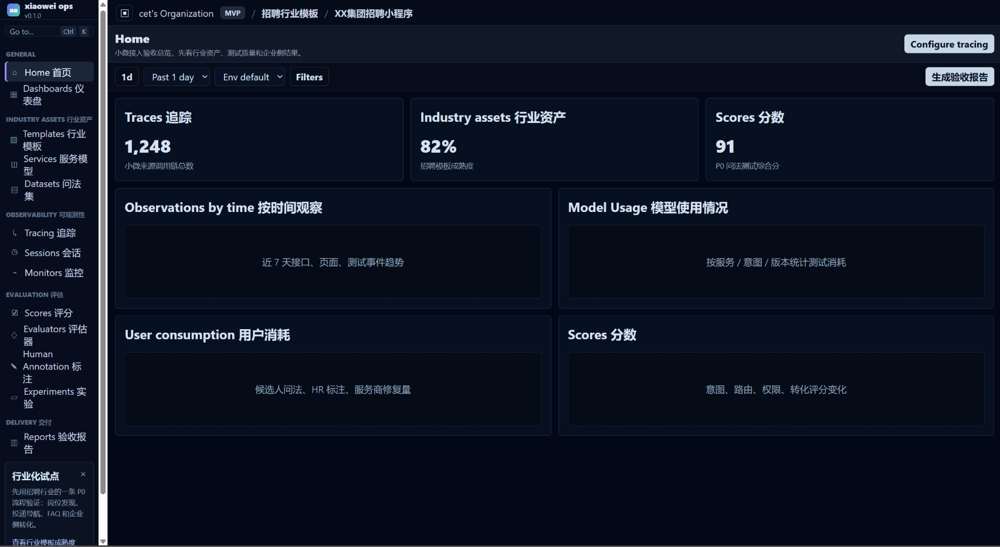

首页用于展示项目总体健康状态，类似 Langfuse 的 Home 总览页。

它回答三个问题：

| 模块 | 含义 |
| --- | --- |
| Traces 追踪 | 小微来源调用链数量，表示有多少用户请求被记录 |
| Industry assets 行业资产 | 招聘行业模板成熟度，体现行业化能力是否沉淀 |
| Scores 分数 | 当前 P0 问法测试综合分 |

下方四个看板分别对应：按时间观察、模型使用、用户消耗、评分变化。这里把 Langfuse 的 LLM 观测逻辑改造成“小微接入质量观测”。

---

## 2. Dashboards 仪表盘

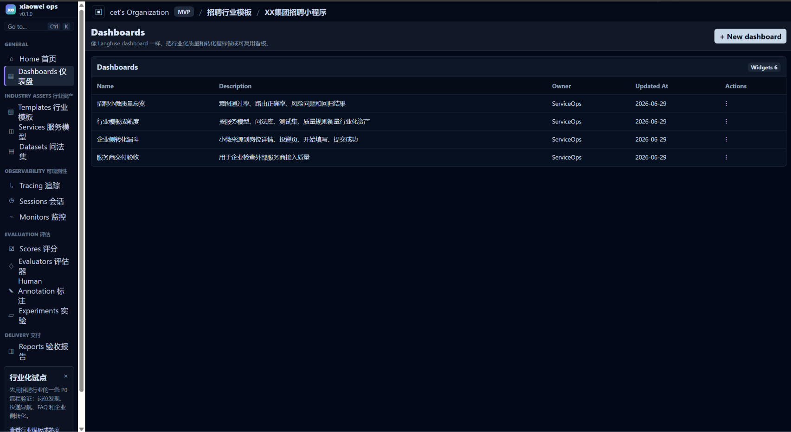

该页用于管理可复用看板。

设计意图：

| 看板 | 用途 |
| --- | --- |
| 招聘小微质量总览 | 看意图通过率、路由正确率、风险问题和回归结果 |
| 行业模板成熟度 | 衡量服务模型、问法库、测试集、质量规则等行业资产 |
| 企业侧转化漏斗 | 看小微来源用户是否进入岗位详情、投递页、开始填写、提交成功 |
| 服务商交付验收 | 企业用来检查外部小程序服务商接入质量 |

这页对应 Langfuse 的 Dashboards，但指标从模型成本/延迟转为小微接入质量和业务转化。

---

## 3. Industry Templates 行业模板

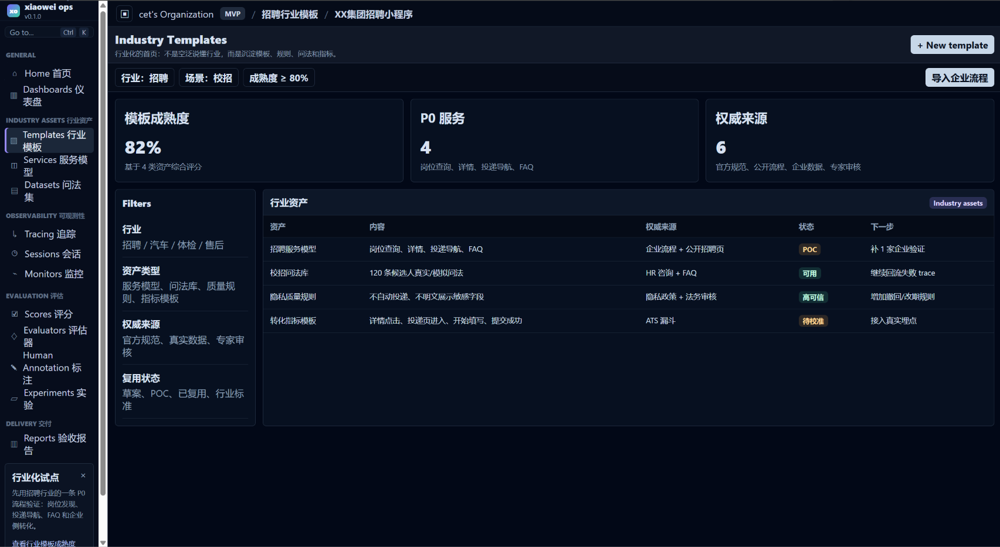

这是本项目“行业化”卖点的核心页面。

它不只是列出行业名称，而是展示行业资产是否真的可复用：

| 行业资产 | 说明 |
| --- | --- |
| 招聘服务模型 | 岗位查询、岗位详情、投递导航、FAQ |
| 校招问法库 | 候选人真实/模拟问法 |
| 隐私质量规则 | 不自动投递、不明文展示敏感字段 |
| 转化指标模板 | 详情点击、投递页进入、开始填写、提交成功 |

页面左侧筛选器强调行业化的判断维度：行业、资产类型、权威来源、复用状态。

---

## 4. Service Model 服务模型

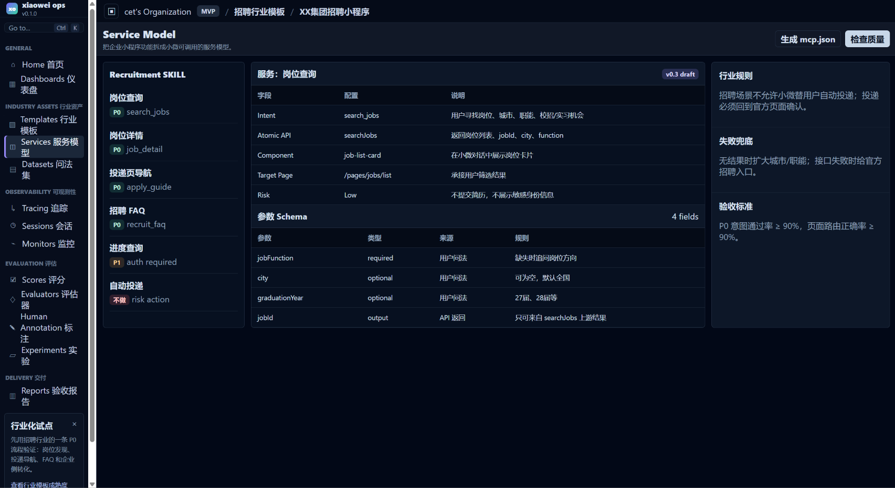

该页把企业小程序服务拆成小微能理解和调用的结构。

它对应 MVP 的“服务建模”能力。

核心内容：

| 区域 | 作用 |
| --- | --- |
| 左侧服务树 | 展示 Recruitment SKILL 下的各项服务 |
| 中间服务详情 | 展示 Intent、Atomic API、Component、Target Page、Risk |
| 参数 Schema | 定义 jobFunction、city、graduationYear、jobId 等参数 |
| 右侧行业规则 | 展示招聘行业特有约束，如不允许自动投递 |

这页的重点是：不是替企业写代码，而是把“小程序功能”整理成“小微可验收的服务模型”。

---

## 5. Datasets 问法集

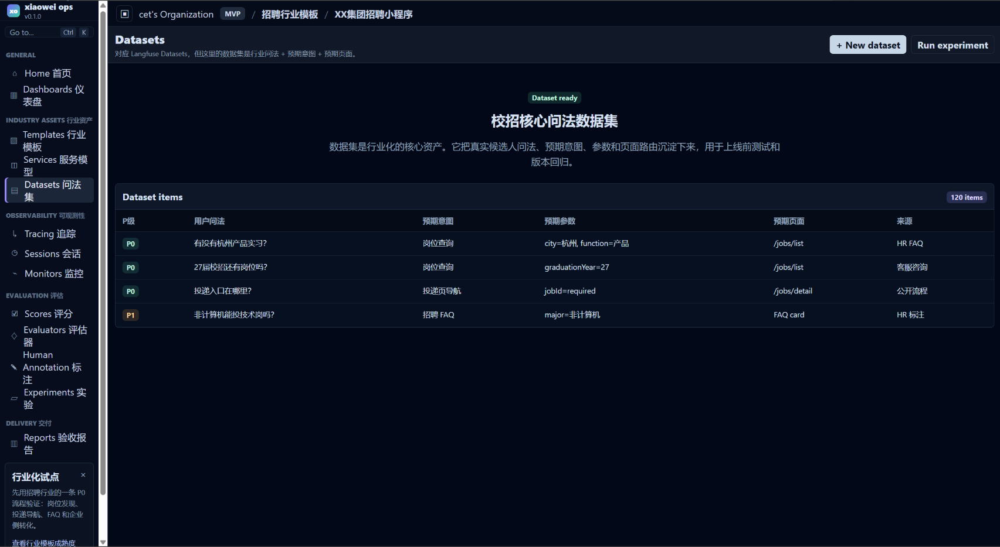

该页对应 Langfuse 的 Datasets，但这里的数据集不是普通 LLM 输入输出，而是：

> 行业问法 + 预期意图 + 预期参数 + 预期页面。

它回答：

| 问题 | 页面如何支持 |
| --- | --- |
| 用户会怎么问？ | 存储候选人真实/模拟问法 |
| 小微应该理解成什么？ | 标注预期意图 |
| 需要抽取哪些信息？ | 标注 city、function、graduationYear 等参数 |
| 应该跳到哪里？ | 标注预期页面 |

这页是行业化的具体沉淀物，也是后续实验和回归测试的基础。

---

## 6. Tracing 追踪

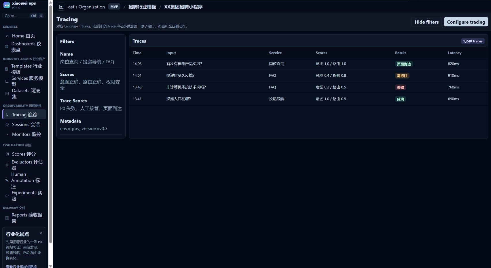

该页对应 Langfuse 的 Tracing，但我们追踪的不是单纯 LLM 调用，而是：

> 用户问法 -> 小微意图 -> 原子接口 -> 页面路由 -> 企业侧动作。

表格展示每条 trace 的：

- 用户输入；
- 命中服务；
- 意图/路由评分；
- 结果状态；
- 延迟。

它用于定位“用户为什么没办成事”：是意图错了、页面跳错了，还是权限兜底了。

---

## 7. Sessions 会话

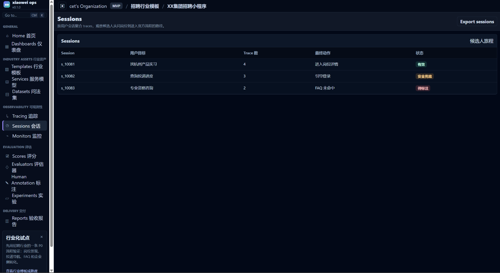

Sessions 把多条 trace 聚合成一个候选人旅程。

它关注的是用户从自然语言需求到官方流程的路径：

| Session | 示例 |
| --- | --- |
| 找杭州产品实习 | 最终进入岗位详情 |
| 查询投递进度 | 被引导登录 |
| 专业资格咨询 | FAQ 未命中，需要补知识库或标注 |

这个页面帮助业务团队理解：小微接入后，用户是否真的进入了企业希望的官方流程。

---

## 8. Monitors 监控

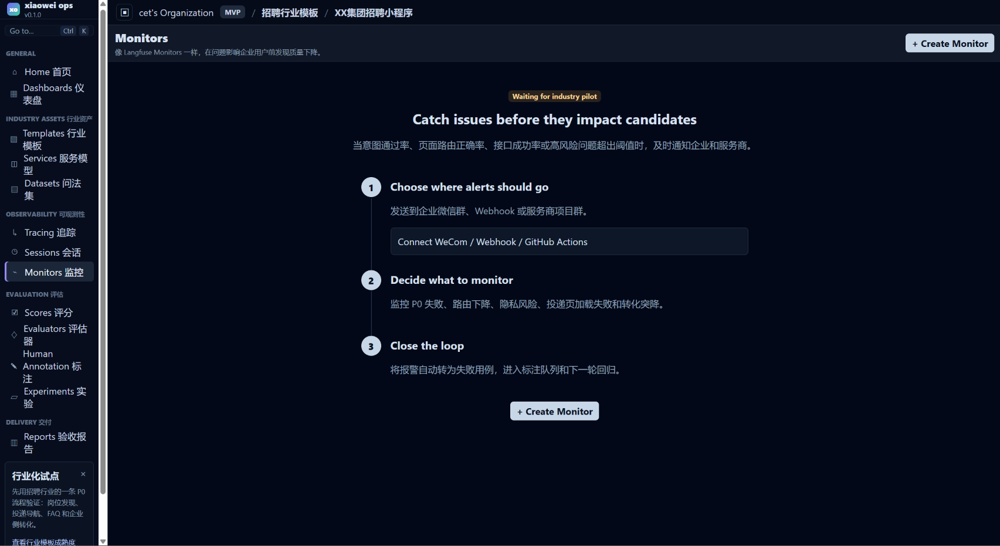

该页借鉴 Langfuse 的 Monitors onboarding 结构。

它用于设置质量报警：

| 监控内容 | 例子 |
| --- | --- |
| 意图通过率下降 | P0 问法测试突然低于 90% |
| 页面路由失败 | 投递页 jobId 深链失效 |
| 隐私风险 | 出现自动投递或敏感字段明文展示 |
| 转化突降 | 投递页进入率或开始填写率异常下降 |

这里体现的是上线后的持续治理，而不是一次性验收。

---

## 9. Scores 评分

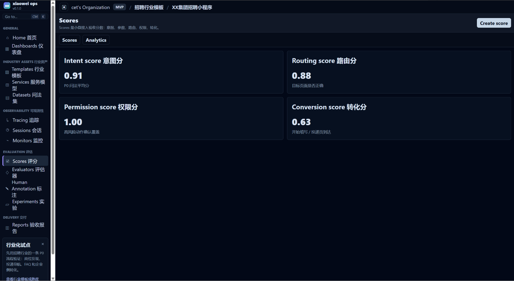

Scores 是小微接入验收分数。

当前拆成四类：

| 分数 | 含义 |
| --- | --- |
| Intent score 意图分 | 用户问法是否命中正确服务 |
| Routing score 路由分 | 是否跳到正确页面 |
| Permission score 权限分 | 高风险动作是否有确认和兜底 |
| Conversion score 转化分 | 用户是否继续进入任务流程 |

这页适合向管理层说明：我们不是只看技术是否接通，而是把质量和业务效果量化。

---

## 10. Evaluators 评估器

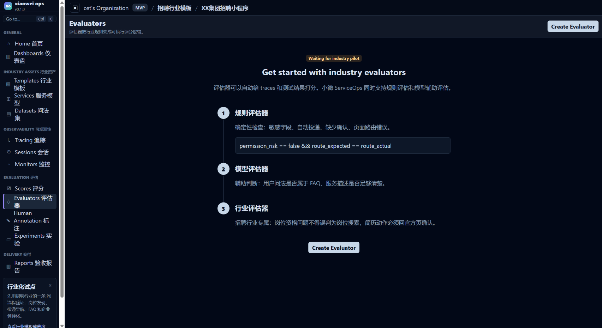

Evaluators 用于把行业规则变成可执行的评分逻辑。

页面中展示三类评估器：

| 评估器 | 用途 |
| --- | --- |
| 规则评估器 | 确定性检查：敏感字段、自动投递、缺少确认、页面路由错误 |
| 模型评估器 | 辅助判断：用户问法是否属于 FAQ，服务描述是否清楚 |
| 行业评估器 | 招聘专属规则，如资格问题不得误判为岗位搜索 |

这页是“行业化质量标准”的执行层。

---

## 11. Human Annotation 标注队列

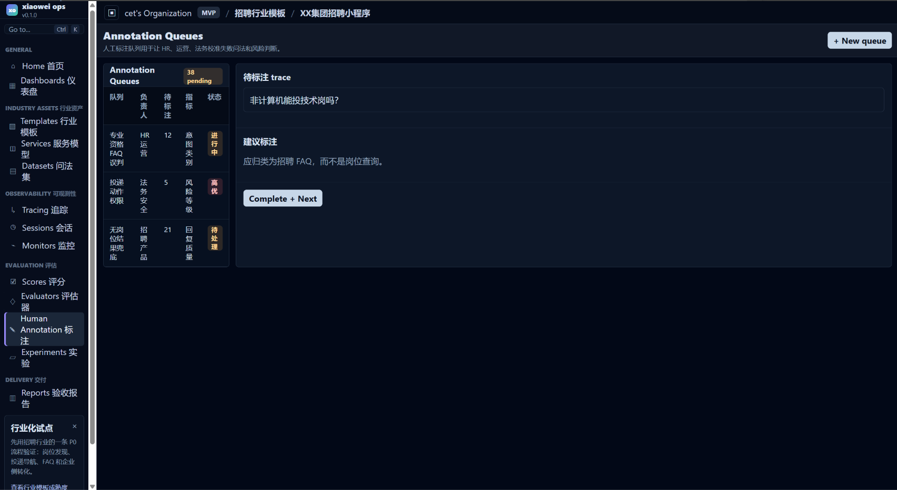

标注队列用于让 HR、运营、法务、安全等角色参与校准。

典型场景：

| 队列 | 负责人 | 作用 |
| --- | --- | --- |
| 专业资格 FAQ 误判 | HR 运营 | 判断是否应归为 FAQ |
| 投递动作权限 | 法务安全 | 判断是否有风险 |
| 无岗位结果兜底 | 招聘产品 | 判断兜底回复是否合适 |

这页体现产品不是纯技术工具，而是跨业务、法务、运营的协同验收台。

---

## 12. Experiments 实验

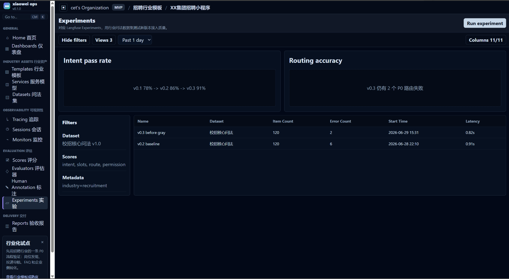

Experiments 用行业问法数据集测试不同版本。

它回答：

> v0.3 是否比 v0.2 接得更好？这次修改有没有破坏旧用例？

页面包含：

- 测试集筛选；
- 版本实验列表；
- 意图通过率趋势；
- 路由准确率；
- 错误数量；
- 延迟。

这页对应 MVP 的“意图测试 + 回归测试”能力。

---

## 13. Reports 验收报告

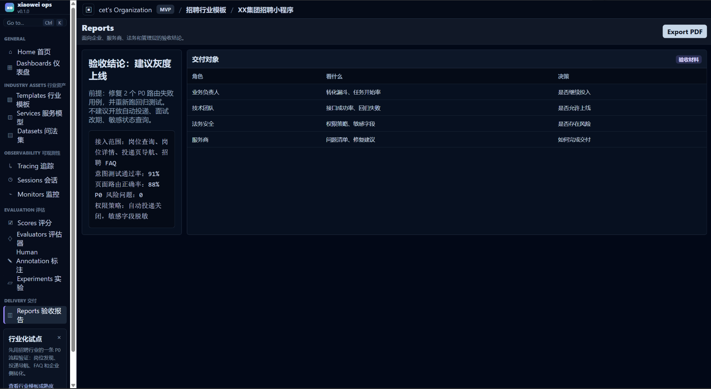

Reports 是面向企业决策者的最终交付物。

报告会告诉不同角色该看什么：

| 角色 | 关注点 |
| --- | --- |
| 业务负责人 | 转化漏斗、任务开始率 |
| 技术团队 | 接口成功率、回归失败 |
| 法务安全 | 权限策略、敏感字段 |
| 服务商 | 问题清单、修复建议 |

当前示例结论是：

> 建议灰度上线，但需先修复 2 个 P0 路由失败用例；不建议开放自动投递、面试改期、敏感状态查询。

这页是商业价值最明确的页面：企业可以用它验收自研团队或小程序服务商的交付质量。

---

## 页面关系

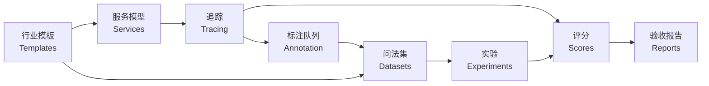

最小闭环是：

> 先沉淀行业模板和问法集，再用服务模型接入小微，用 trace 观察真实调用，用 scores/evaluators 做质量判断，用 annotation 回流失败样本，最后输出 reports 作为企业验收材料。

---

## MVP 边界

本原型展示的是“接入质量验收台”，不是完整生产系统。

它做：

- 行业模板展示；
- 服务模型展示；
- 问法数据集展示；
- 追踪、会话、监控、评分、评估器、标注队列；
- 实验对比；
- 验收报告。

它不做：

- 不替企业开发小程序；
- 不承诺小微官方曝光和排序；
- 不自动帮用户投递简历；
- 不替代微信开发者工具；
- 不展示真实生产数据。
