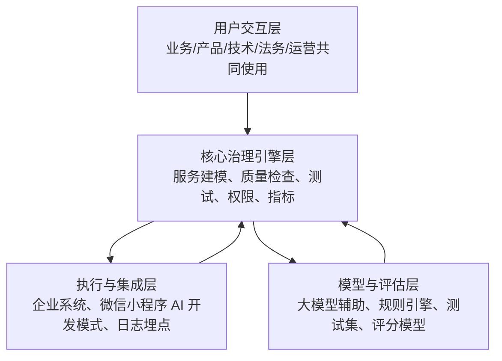
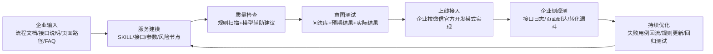
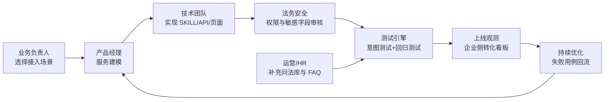
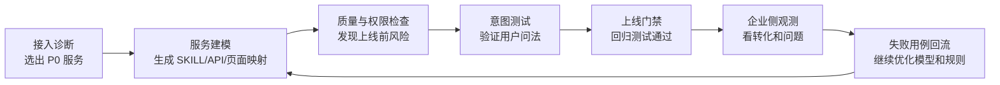

# 小微 ServiceOps 能力可行性与价值指标分析

<!-- TOC -->

- [小微 ServiceOps 能力可行性与价值指标分析](#小微-serviceops-能力可行性与价值指标分析)
  - [1. 结论先行](#1-结论先行)
  - [2. 关于微信开发者文档](#2-关于微信开发者文档)
  - [3. 类似产品与竞品判断](#3-类似产品与竞品判断)
    - [3.1 相邻竞品类型](#31-相邻竞品类型)
    - [3.2 竞品结论](#32-竞品结论)
  - [4. 企业自研与微信官方实现风险](#4-企业自研与微信官方实现风险)
    - [4.1 企业为什么可能自研](#41-企业为什么可能自研)
    - [4.2 微信官方为什么可能实现](#42-微信官方为什么可能实现)
    - [4.3 产品成立条件](#43-产品成立条件)
  - [5. 项目可行性的核心论证](#5-项目可行性的核心论证)
    - [第一，企业能做一部分，但很难形成行业化治理体系](#第一企业能做一部分但很难形成行业化治理体系)
    - [第二，微信官方会做底座，但不会深入每个行业](#第二微信官方会做底座但不会深入每个行业)
    - [第三，相邻竞品覆盖局部能力，但没有围绕小微新生态设计](#第三相邻竞品覆盖局部能力但没有围绕小微新生态设计)
    - [最终可行性判断](#最终可行性判断)
    - [5.1 行业化能力与权威性来源](#51-行业化能力与权威性来源)
      - [权威性从哪里来](#权威性从哪里来)
      - [为什么必须进入真实企业场景](#为什么必须进入真实企业场景)
  - [6. 首批行业选择建议](#6-首批行业选择建议)
    - [可选行业对比](#可选行业对比)
    - [行业选择建议](#行业选择建议)
  - [7. 项目架构建议](#7-项目架构建议)
    - [7.1 架构总览](#71-架构总览)
    - [7.2 用户交互层](#72-用户交互层)
    - [7.3 核心治理引擎层](#73-核心治理引擎层)
    - [7.4 执行与集成层](#74-执行与集成层)
    - [7.5 模型与评估层](#75-模型与评估层)
    - [7.6 数据流](#76-数据流)
  - [8. 角色、需求与使用流程](#8-角色需求与使用流程)
    - [8.1 角色分工](#81-角色分工)
    - [8.2 端到端使用流程](#82-端到端使用流程)
    - [8.3 分角色产品流程](#83-分角色产品流程)
    - [8.4 技术与数据总表](#84-技术与数据总表)
  - [9. 企业需要提供什么：必要性、风险与替代方案](#9-企业需要提供什么必要性风险与替代方案)
    - [9.1 企业输入材料总表](#91-企业输入材料总表)
    - [9.2 为什么行业问法和测试集不能完全由企业提供](#92-为什么行业问法和测试集不能完全由企业提供)
    - [9.3 调试和测试环境能不能线上化](#93-调试和测试环境能不能线上化)
    - [9.4 企业不愿意提供材料时的产品方案](#94-企业不愿意提供材料时的产品方案)
  - [10. 小微模型不开源时的测试一致性问题](#10-小微模型不开源时的测试一致性问题)
    - [10.1 三层一致性策略](#101-三层一致性策略)
    - [10.2 如何衡量“本地测试模型”和“真实小微”的差距](#102-如何衡量本地测试模型和真实小微的差距)
    - [10.3 如何让差距可控](#103-如何让差距可控)
  - [11. 核心能力](#11-核心能力)
    - [11.1 能力一：服务建模](#111-能力一服务建模)
      - [能力定义](#能力定义)
      - [官方文档可行性依据](#官方文档可行性依据)
      - [第三方可做什么](#第三方可做什么)
        - [怎么完成：技术与数据需求](#怎么完成技术与数据需求)
      - [可行性判断](#可行性判断)
        - [企业自研、官方实现、竞品比较](#企业自研官方实现竞品比较)
    - [11.2 能力二：SKILL 质量检查](#112-能力二skill-质量检查)
      - [能力定义](#能力定义-1)
      - [官方文档可行性依据](#官方文档可行性依据-1)
      - [第三方可做什么](#第三方可做什么-1)
      - [怎么完成：技术与数据需求](#怎么完成技术与数据需求-1)
      - [可行性判断](#可行性判断-1)
      - [企业自研、官方实现、竞品比较](#企业自研官方实现竞品比较-1)
      - [企业价值指标](#企业价值指标)
    - [11.3 能力三：意图测试](#113-能力三意图测试)
      - [能力定义](#能力定义-2)
      - [官方文档可行性依据](#官方文档可行性依据-2)
      - [第三方可做什么](#第三方可做什么-2)
      - [怎么完成：技术与数据需求](#怎么完成技术与数据需求-2)
      - [可行性判断](#可行性判断-2)
      - [企业自研、官方实现、竞品比较](#企业自研官方实现竞品比较-2)
      - [关键边界](#关键边界)
    - [11.4 能力四：回归测试](#114-能力四回归测试)
      - [能力定义](#能力定义-3)
      - [官方文档可行性依据](#官方文档可行性依据-3)
      - [第三方可做什么](#第三方可做什么-3)
      - [怎么完成：技术与数据需求](#怎么完成技术与数据需求-3)
      - [可行性判断](#可行性判断-3)
      - [企业自研、官方实现、竞品比较](#企业自研官方实现竞品比较-3)
    - [11.5 能力五：权限策略](#115-能力五权限策略)
      - [能力定义](#能力定义-4)
      - [官方文档可行性依据](#官方文档可行性依据-4)
      - [第三方可做什么](#第三方可做什么-4)
      - [怎么完成：技术与数据需求](#怎么完成技术与数据需求-4)
      - [可行性判断](#可行性判断-4)
      - [企业自研、官方实现、竞品比较](#企业自研官方实现竞品比较-4)
    - [11.6 能力六：企业侧转化观测](#116-能力六企业侧转化观测)
      - [能力定义](#能力定义-5)
      - [官方文档可行性依据](#官方文档可行性依据-5)
      - [第三方可做什么](#第三方可做什么-5)
      - [怎么完成：技术与数据需求](#怎么完成技术与数据需求-5)
      - [可行性判断](#可行性判断-5)
      - [企业自研、官方实现、竞品比较](#企业自研官方实现竞品比较-5)
  - [12. 如何让企业相信这个产品有价值](#12-如何让企业相信这个产品有价值)
    - [12.1 第一层：接入质量指标](#121-第一层接入质量指标)
    - [12.2 第二层：用户体验指标](#122-第二层用户体验指标)
    - [12.3 第三层：业务结果指标](#123-第三层业务结果指标)
  - [13. 企业采购理由设计](#13-企业采购理由设计)
    - [13.1 对业务部门](#131-对业务部门)
    - [13.2 对技术部门](#132-对技术部门)
    - [13.3 对法务 / 安全部门](#133-对法务--安全部门)
    - [13.4 对管理层](#134-对管理层)
  - [14. 商业模式与付费设计](#14-商业模式与付费设计)
    - [14.1 相邻竞品的付费方式](#141-相邻竞品的付费方式)
    - [14.2 本项目推荐收费结构](#142-本项目推荐收费结构)
    - [14.3 版本设计草案](#143-版本设计草案)
  - [15. MVP 节点与指标方案](#15-mvp-节点与指标方案)
    - [15.1 MVP 想验证的核心假设](#151-mvp-想验证的核心假设)
    - [15.2 核心假设的验证指标](#152-核心假设的验证指标)
    - [15.3 MVP 节点拆解](#153-mvp-节点拆解)
    - [15.4 接入前基线](#154-接入前基线)
    - [15.5 接入质量指标：来源与评测标准](#155-接入质量指标来源与评测标准)
    - [15.6 上线后企业侧指标：来源与评测标准](#156-上线后企业侧指标来源与评测标准)
    - [15.7 指标评估](#157-指标评估)
    - [15.8  MVP 取舍](#158--mvp-取舍)
  - [16. 事故与责任划分](#16-事故与责任划分)
    - [16.1 可能出现的问题类型](#161-可能出现的问题类型)
    - [16.2 责任划分原则](#162-责任划分原则)
    - [16.3 报告中必须保留的证据链](#163-报告中必须保留的证据链)
    - [16.4 免责声明建议](#164-免责声明建议)
  - [17. 最大不确定性：小微生态本身是否真的成立](#17-最大不确定性小微生态本身是否真的成立)
    - [17.1 不确定性来自哪里](#171-不确定性来自哪里)
    - [17.2 如何判断小微不是“噱头”](#172-如何判断小微不是噱头)
    - [17.3 对本项目的影响](#173-对本项目的影响)
    - [17.4 风险总结](#174-风险总结)
  - [18. 最终能力边界](#18-最终能力边界)
    - [可以承诺](#可以承诺)
    - [不能承诺](#不能承诺)
  - [19. 总结](#19-总结)

<!-- /TOC -->

## 1. 结论先行

基于目前微信官方文档，企业级 ServiceOps 平台的方向是可行的，但必须避开官方已经覆盖的“基础接入框架”，转向企业侧的“质量治理与运营优化”。

更准确的定位应是：

> **小微 ServiceOps 是企业小程序 AI 开发模式下的服务建模、质量检测、测试回归、权限治理和企业侧转化观测平台。**

用更直白的话说：

> 企业可以自己接小微，也可以找小程序服务商接小微；小微 ServiceOps 不一定替企业完成接入开发，而是提供一套行业化的接入质量标准、测试工具和观测体系，帮助企业判断“接得对不对、稳不稳、安不安全、有没有业务效果”。

如果用一句行业小白也能理解的话概括：

> 这是一个企业接入小微的“质检台 + 测试台 + 监控台”。

它的核心不是替企业写小程序，也不是替小微分发流量，而是帮企业把原本给人点击的小程序服务，整理成 AI 能调用的服务，并在上线前检查、测试、控权限，上线后观察有没有真的带来转化。

它不替代微信官方能力：

- 不替代 SKILL / 原子接口 / 原子组件框架；
- 不替代微信开发者工具；
- 不承诺提升小微官方排序；
- 不承诺看到小微内部曝光、推荐和模型推理数据。

它补充官方能力：

- 帮企业判断哪些服务值得接入；
- 帮企业把复杂业务流程拆成合适的 SKILL 和原子接口；
- 帮企业检查 `mcp.json`、`SKILL.md`、`AGENTS.md`、页面元数据是否高质量；
- 帮企业批量测试用户问法，减少误调用、错路由和参数错误；
- 帮企业做版本回归测试；
- 帮企业配置权限、敏感信息和人工接管策略；
- 帮企业观察自己可掌握的后半段转化效果。

---

## 2. 关于微信开发者文档

微信官方文档已经明确，小程序 AI 开发模式要求开发者将小程序能力抽象为 SKILL、原子接口、原子组件、知识库、页面元数据和调试链路。这些官方能力构成了本项目可行性判断的基础。

主要来源：

| 官方文档 | 主要说明 | 对本项目的启发 |
| --- | --- | --- |
| [小程序 AI 开发模式指南](https://developers.weixin.qq.com/miniprogram/dev/ai/guide.html) | 介绍小程序 AI 开发模式、SKILL、原子接口、原子组件、知识库等基础概念 | 说明微信官方已经提供基础接入框架，第三方机会不在“重新做开发框架”，而在企业侧治理 |
| [运行机制](https://developers.weixin.qq.com/miniprogram/dev/ai/operating-mechanism.html) | 解释小微如何理解用户请求、选择能力、调用小程序能力并返回结果 | 说明服务描述、接口 Schema、页面元数据会影响小微调用质量，因此存在质量检测空间 |
| [调试指南](https://developers.weixin.qq.com/miniprogram/dev/ai/debugging.html) | 说明调试工具、开发版/体验版测试、SKILL 和知识库测试边界 | 说明第三方平台可以做云端预检，但真实小微效果仍需要官方环境黑盒测试 |
| [最佳实践](https://developers.weixin.qq.com/miniprogram/dev/ai/best-practices.html) | 说明 SKILL、接口描述、组件、知识库和页面跳转等实践建议 | 可以沉淀为小微 ServiceOps 的规则库、质量检查项和行业模板 |
| [原子组件参考](https://developers.weixin.qq.com/miniprogram/dev/ai/reference/component.html) | 说明原子组件、页面关联和对话流 GUI 呈现方式 | 支持检查组件绑定、页面路由和结果展示是否可靠 |
| [接入与集成](https://developers.weixin.qq.com/miniprogram/dev/ai/integration.html) | 说明小程序 AI 接入相关配置、SKILL 文件和调用集成方式 | 支持检查 `mcp.json`、`SKILL.md`、接口契约和接入完整性 |

基于这些文档，可以把官方能力拆成以下对象：

1. **SKILL**
   完成某一类任务的能力封装。

2. **原子接口**
   最小执行单元，具有标准输入参数和输出结构。

3. **原子组件**
   将原子接口返回的数据渲染为对话流中的 GUI 卡片。

4. **`mcp.json`**
   声明模型可调用能力，包括接口名称、描述、入参、出参和组件绑定。

5. **`SKILL.md`**
   描述业务流程、接口依赖、跨接口规则和通用约束。

6. **`AGENTS.md`**
   描述整体服务范围、多个 SKILL 的关系和全局行为逻辑。

7. **知识库**
   用于专业知识、FAQ 和兜底回答。

8. **页面元数据**
   支持小程序 AI 生成文字链，拉起小程序页面。

9. **中间件**
   可用于统一登录、上报和错误监听。

10. **小程序与 AI 会话交互接口**
    包括 `wx.openAgent`、`wx.onAgentOpen`、`wx.navigateBackAgent` 等。

这些能力说明：

> 微信官方已经解决了“开发者如何接入小微”的基础问题，但没有完全解决“企业如何判断接什么、怎么拆服务、怎么保证质量、怎么测试、怎么监控效果”的企业级治理问题。

---

## 3. 类似产品与竞品判断

小微 ServiceOps 不是完全空白的新物种。更准确地说，它是在以下几类成熟能力交叉处做垂直化收敛：

> LLMOps / AgentOps + API 质量治理 + 企业流程测试 + 微信小程序 AI 开发模式适配。

### 3.1 相邻竞品类型

| 类型 | 代表 | 会覆盖什么 | 覆盖不了什么 |
| --- | --- | --- | --- |
| 微信官方能力 | 小程序 AI 开发模式、开发者工具、调试器、知识库、SKILL 框架 | 基础接入、开发规范、组件/API、调试流程 | 企业业务流程怎么拆、怎么测试、怎么衡量 ROI |
| LLMOps / AgentOps | LangSmith、Langfuse、Arize Phoenix | Trace、评估、Prompt 管理、线上观测 | 不懂微信小程序 SKILL、原子组件、页面元数据和审核约束 |
| LLM 测试 / 红队 | promptfoo 等 | 批量测试、评估、安全测试 | 不懂企业小程序业务流程和微信开发模式 |
| AI 应用搭建平台 | Dify、Coze、MaxKB、Copilot Studio 等 | Agent、workflow、知识库、工具调用搭建 | 不专门解决小程序 AI 开发模式接入质量 |
| 传统 API / APM / 可观测 | Postman、Apigee、Datadog、New Relic 等 | API 测试、日志、性能、告警 | 不懂自然语言意图、SKILL 选择、参数抽取和 AI 错路由 |
| 小程序服务商 / SI | 微盟、有赞、腾讯云服务商、小程序开发商 | 项目交付、开发实现、系统集成 | 不一定有标准化意图测试、回归测试、质量评分和行业模板 |

### 3.2 竞品结论

因此，这个产品不能定位为：

1. 通用 AI 应用搭建平台；
2. 小微开发工具；
3. 小程序代开发服务；
4. 通用 LLMOps 平台；
5. 通用 API 监控平台。

更准确的定位是：

> **小微开发模式下的行业化接入质量治理工具。**

它的核心差异化不在底层模型或开发框架，而在：

1. 微信小程序 AI 开发模式适配；
2. 行业服务建模模板；
3. SKILL / mcp.json / SKILL.md 质量规则；
4. 真实用户问法测试集；
5. 小微接入版本回归测试；
6. 权限和敏感字段策略；
7. 企业侧转化漏斗模板。

---

## 4. 企业自研与微信官方实现风险

这个方向有两个非常现实的挤压来源：

1. 企业自己实现；
2. 微信官方实现。

### 4.1 企业为什么可能自研

中大型企业往往有技术团队，完全可以照着官方文档自己完成：

1. 写 SKILL；
2. 写原子接口；
3. 配 `mcp.json`；
4. 写 `SKILL.md`；
5. 接 CRM / ATS / HIS / ERP；
6. 加日志；
7. 做基础埋点。

所以不能把产品价值说成：

> 企业不会接小微，我们帮它接。

这个价值主张太弱。

更合理的价值主张是：

> 企业可以自己接，但很难低成本、系统性地保证接得对、测得全、上线后可控、跨团队能协同。

企业自研容易做的是开发实现；不一定愿意反复沉淀的是：

1. 行业化服务建模模板；
2. SKILL 质量检查规则；
3. 大量用户问法测试集；
4. 回归测试体系；
5. 敏感字段和风险动作策略；
6. 跨版本质量对比；
7. 企业侧转化漏斗模板；
8. 产品、技术、法务、运营共用的接入治理台。

因此，护城河不在“开发能力”，而在：

> **行业模板 + 测试数据集 + 质量规则 + 治理流程 + 指标体系。**

### 4.2 微信官方为什么可能实现

微信官方最容易继续补齐的是：

1. SKILL 基础开发框架；
2. 官方调试器；
3. 知识库上传；
4. 组件/API 支持；
5. 页面元数据；
6. 官方审核建议；
7. 基础质量提示；
8. 调用日志或错误日志。

这些不应成为第三方产品的核心壁垒。

但官方未必会深做每个行业的企业流程治理，例如：

1. 招聘里的岗位查询、投递、内推、测评、面试改期如何拆服务；
2. 医疗体检里的预约、报告、复诊、隐私权限如何分级；
3. 车企里的试驾、顾问分配、金融方案、售后如何编排；
4. 品牌售后里的工单、保修、配件、网点和服务状态如何建模；
5. 企业如何用一套测试集证明小微接入后转化提升。

所以，官方更可能做通用底座，第三方更适合做：

> **行业化接入质量方案。**

### 4.3 产品成立条件

这个产品成立的前提不是“企业不会接小微”，而是：

> 企业会接小微，但接入质量、测试、合规和业务效果验证会变成持续问题。

如果企业只是做简单问答或页面跳转，不需要这个产品。

如果企业具备以下特征，才更可能有价值：

1. 自有流程不可替代；
2. 有小程序 / 官网 / 业务系统；
3. 有技术团队但缺小微接入治理经验；
4. 有明确转化指标；
5. 行业流程复杂；
6. 合规或隐私要求较高；
7. 需要持续迭代，而不是一次性上线。

---

## 5. 项目可行性的核心论证

经过对企业自研、微信官方能力和相邻竞品的比较，当前最重要的判断是：

> **这个项目的机会来自能力拼图的空缺，而不是技术垄断。**

可以拆成三条：

### 第一，企业能做一部分，但很难形成行业化治理体系

企业自己确实能做一部分小微接入，比如写 SKILL、接接口、改页面、做基础日志。

但大多数企业会围绕自身业务做项目式实现，很难长期沉淀：

1. 行业规范；
2. 标准服务模型；
3. 用户问法测试集；
4. SKILL 质量规则；
5. 回归测试体系；
6. 权限和敏感字段策略；
7. 持续治理和指标看板。

也就是说，企业能做“一个接入项目”，但不一定愿意或有能力沉淀“小微接入质量治理体系”。

### 第二，微信官方会做底座，但不会深入每个行业

微信官方会提供：

1. 基础开发框架；
2. SKILL / 原子接口 / 原子组件机制；
3. 调试工具；
4. 知识库；
5. 页面元数据；
6. 组件和 API 能力；
7. 通用最佳实践。

但微信官方不会深入每个行业替企业做：

1. 服务建模；
2. 流程拆解；
3. 业务优先级判断；
4. 合规策略；
5. 行业问法测试集；
6. 企业转化指标设计；
7. 业务 ROI 评估。

官方更适合做通用平台能力，行业化接入质量治理更适合由第三方或服务商完成。

### 第三，相邻竞品覆盖局部能力，但没有围绕小微新生态设计

LLMOps、Agent 平台、API 监控工具、小程序服务商各自覆盖一部分能力：

1. LLMOps 能做评估、Trace 和观测；
2. Agent 平台能做工作流和工具调用；
3. API 监控工具能做接口性能和错误监控；
4. 小程序服务商能做开发和交付。

但它们目前还没有围绕“小微开发模式”这个新出现的业态，形成行业化接入质量治理产品。

它们通常不同时理解：

1. 微信小程序 AI 开发模式；
2. SKILL / mcp.json / SKILL.md 的质量要求；
3. 原子组件和页面元数据约束；
4. 小程序官方流程的业务转化；
5. 行业服务模型；
6. 小微接入后的企业侧指标体系。

### 最终可行性判断

因此，小微 ServiceOps 的可行性来自这三方之间的空档：

| 参与方 | 能做什么 | 不足 | 留给本产品的空间 |
| --- | --- | --- | --- |
| 企业自研 | 写 SKILL、接接口、改页面、做基础日志 | 项目式、非标准化，缺行业测试集和治理体系 | 提供行业模板、质量规则、回归测试 |
| 微信官方 | 提供开发框架、调试工具、组件/API、最佳实践 | 不深入单行业业务流程和企业 ROI | 做行业化服务建模和效果评估 |
| 相邻竞品 | 做通用 Agent、LLMOps、API 监控、小程序开发 | 不针对小微，不理解微信开发模式和行业流程 | 做垂直的小微 ServiceOps |
| 本产品 | 整合行业流程、小微规范、测试治理和转化指标 | 依赖小微生态发展，需要行业沉淀 | 先从单行业 MVP 切入，逐步模板化 |

一句话总结：

> 企业有业务和系统，微信有平台和开发规范，LLMOps / AgentOps 有通用测试与观测能力，但它们之间缺少一个面向小微生态的行业化接入质量治理层。小微 ServiceOps 要卡住的正是这一层。

### 5.1 行业化能力与权威性来源

在讨论行业化之前，需要先明确一个前提：首个行业不能只按市场想象选择，必须结合团队现实情况和行业研调来确定。

具体来说，应同时看两类因素：

1. **团队已有资源**：是否有历史合作项目、已有客户关系、可访问的行业专家、可接触的小程序服务商、既有数据样本或行业理解。
2. **行业外部条件**：是否符合小微推广需求、企业自研能力、流程规范化、官网 / 小程序必要性等指标。

具体标准6会探讨。

如果团队在某个行业有历史合作项目、现成客户或可获取的一线业务数据，即使该行业不是理论上最优，也可能更适合作为 MVP；反过来，如果某个行业看起来市场空间很大，但团队无法拿到企业合作和真实数据，就很难把行业化做深。

行业化不能只是“我们懂某个行业”的口号，也不能只是把公开页面整理成模板。它必须变成可验证、可复用、可持续更新的产品资产。

小微 ServiceOps 的行业化能力至少包括五类资产：

| 行业化资产 | 具体内容 | 招聘行业例子 |
| --- | --- | --- |
| 行业服务模型 | 将行业常见服务拆成意图、参数、原子接口、页面、组件、风险节点和兜底路径 | 岗位查询、岗位详情、投递导航、投递进度查询、面试改期、FAQ |
| 行业问法库 | 用户在该行业真实会如何表达需求，包含同义问法、模糊问法、异常问法 | “北京有产品实习吗”“应届生能投吗”“投递后多久反馈” |
| 行业测试集 | 每类问法对应的预期意图、槽位、页面、接口返回和失败分支 | 城市=北京，职能=产品，学历=本科，预期页面=岗位列表 |
| 行业质量规则 | 对该行业特别重要的字段、动作、承诺、权限和敏感信息检查规则 | 不明文展示手机号/身份证，不替用户自动投递，不承诺录用结果 |
| 行业指标模板 | 上线后判断服务是否有效的转化漏斗和质量指标 | 岗位详情点击率、开始填写率、提交完成率、有效简历率、人工咨询下降 |

因此，行业化的核心不是“做一个模板”，而是：

> 把行业流程、真实问法、测试预期、质量规则和业务指标沉淀成一套可以被企业、服务商和开发团队共同使用的接入质量标准。

#### 权威性从哪里来

如果行业模板要成为付费卖点，就必须解释“凭什么这个模板是可信的”。权威性可以分层获得：

| 权威来源 | 具体获得方式 | 可信度 | 适合阶段 |
| --- | --- | --- | --- |
| 微信官方规范 | 小程序 AI 开发模式文档、SKILL / 原子接口 / 原子组件规范、平台最佳实践 | 高 | 必须作为底层约束 |
| 行业公开规范 | 法律法规、监管要求、行业协会标准、公开服务流程、企业隐私政策 | 高 | 模板草案阶段即可使用 |
| 标杆企业公开流程 | 头部企业官网、小程序、招聘官网、售后页、预约页、FAQ | 中-高 | 用于构建行业流程基线 |
| 合作企业真实数据 | 脱敏客服工单、搜索词、咨询记录、ATS/CRM/工单字段、页面埋点 | 高 | MVP / POC 阶段最关键 |
| 专家评审 | 行业运营、HR、法务、安全、技术负责人审核模板和测试集 | 中-高 | 增强模板可信度 |
| 跨客户沉淀 | 多个客户试点后的匿名失败用例、常见问法、质量问题、转化基准 | 最高 | 长期壁垒 |

可以概括为：

> 初期权威性来自“官方规范 + 公开行业流程 + 合作企业真实数据 + 专家审核”；长期权威性来自“跨客户测试集、失败用例和指标基准沉淀”。

#### 为什么必须进入真实企业场景

公开资料可以支撑行业化 0.5 版，但不能支撑真正可售卖的行业化 1.0 版。

| 行业资产 | 公开资料能做什么 | 为什么仍需要企业合作 |
| --- | --- | --- |
| 行业服务模型 | 能看到官网或小程序表层流程 | 看不到真实业务规则、异常分支、系统限制和审批逻辑 |
| 行业问法库 | 能模拟少量典型问法 | 高频问题、边界问题和失败问法来自一线客服、HR、销售和运营 |
| 行业测试集 | 能做演示测试集 | 真正有价值的测试集要覆盖真实用户表达和真实失败场景 |
| 权限策略 | 能参考法规和隐私政策 | 企业内部字段分级、系统权限和审批要求通常不公开 |
| 转化指标 | 能设计指标模板 | 真实漏斗、流失点、有效线索定义需要企业业务系统数据 |
| 验收标准 | 能设定初始阈值 | 企业能接受的质量门槛需要通过试点校准 |

所以，如果“行业化”要成为核心卖点，必须和行业内企业或服务商合作。但合作可以分阶段推进，不需要一开始拿到头部企业的全量数据：

| 阶段 | 合作方式 | 目标 | 需要的数据 |
| --- | --- | --- | --- |
| 0. 桌面研究 | 研究公开官网、小程序、隐私政策、FAQ、行业规范 | 形成行业模板草案 | 公开流程、公开字段、公开 FAQ |
| 1. 轻量访谈 | 访谈 5-10 位行业从业者、HR、运营、客服、服务商 | 校准真实痛点和流程 | 高频问题、常见异常、现有接入难点 |
| 2. 企业 POC | 找 1-2 家企业或服务商围绕一条 P0 流程试点 | 验证工具能否降本、提质、控风险 | 脱敏问法、接口文档、页面路径、测试环境、部分漏斗数据 |
| 3. 标杆共建 | 与代表性企业共建行业模板 | 形成案例、验收报告和行业指标口径 | 更完整的失败用例、日志、转化数据和上线复盘 |
| 4. 跨客户沉淀 | 在多个同类客户中复用和迭代 | 形成行业基准和护城河 | 匿名统计、共性失败类型、最佳实践 |

早期 MVP 最小可行合作不需要很重，最低需要：

1. 一条具体 P0 流程，例如招聘里的“岗位发现 + 投递页导航 + 进度查询”；
2. 100-300 条脱敏真实问法或客服 / HR 高频问题；
3. 页面路径、字段结构和基础接口说明；
4. 测试环境或模拟接口；
5. 上线前后部分企业侧指标，例如页面直达率、开始填写率、提交完成率、客服咨询变化。

判断行业化是否成立，可以分三步：

> 第一个客户验证“能解决真实问题”，第二个客户验证“能复用”，第三个客户开始验证“能形成行业标准”。

这也回应了小程序服务商的重合问题：服务商能做单个客户的小微接入项目，但小微 ServiceOps 要沉淀的是经过官方规范、真实数据、测试验证和跨客户复用形成的行业接入质量资产。

---

## 6. 首批行业选择建议

既然小微 ServiceOps 的核心壁垒来自行业模板和业务测试集，那么第一版必须选择一个行业做深，而不是泛化覆盖所有行业。

行业选择可按四个指标判断：

| 指标 | 含义 |
| --- | --- |
| 小微推广需求 | 用户是否会在微信里自然表达这类需求 |
| 企业自研能力 | 企业是否能自己做，以及是否仍需要外部工具 |
| 流程规范化 | 是否有清晰流程，适合建模、测试和回归 |
| 官网 / 小程序必要性 | 最终动作是否必须回到官方系统完成 |

### 可选行业对比

| 行业 | 小微推广需求 | 自研能力 | 流程规范化 | 官网/小程序必要性 | 综合判断 |
| --- | --- | --- | --- | --- | --- |
| 汽车 / 4S / 试驾售后 | 高 | 主机厂强、经销商弱 | 中-高 | 高 | 最适合商业化 MVP，线索价值高、隐私风险适中 |
| 招聘 / 校招 / 实习招聘 | 中-高 | 中-强 | 高 | 高 | 流程最清晰、指标最好设计，但简历隐私需要克制 |
| 品牌售后 / 家电维修 / 数码售后 | 高 | 品牌方中-强 | 高 | 高 | 任务明确、官方流程强，但系统集成较重 |
| 连锁体检 / 口腔 / 医疗服务 | 高 | 中 | 高 | 很高 | 需求强，但医疗健康隐私和合规风险更高 |
| 教培 / 留学 / 职业培训 | 中-高 | 中 | 中-高 | 高 | 私域和咨询价值强，但行业稳定性和销售依赖要考虑 |

### 行业选择建议

如果想贴近原题里的“本地门店”，优先考虑：

> **汽车 / 4S / 试驾售后。**

原因：

1. 有线下门店和本地服务属性；
2. 用户会在微信里自然问车型、试驾、优惠、保养、售后；
3. 试驾预约和售后保养必须回到品牌或经销商官方流程；
4. 单条线索价值高，企业更容易理解 ROI；
5. 隐私风险低于招聘和医疗；
6. 主机厂、经销商集团、4S 店之间存在流程标准化和协同需求。

如果想让流程建模和指标设计最清楚，优先考虑：

> **招聘 / 校招 / 实习招聘。**

原因：

1. 岗位、城市、职能、学历、毕业年份、投递状态等字段清楚；
2. 岗位查询、简历投递、进度查询、面试预约可建模；
3. 有效简历、投递完成率、候选人获取成本等指标明确；
4. 但必须避免自动填简历和自动投递，MVP 应停留在岗位匹配、页面直达、意图测试和企业侧转化观测。

---

## 7. 项目架构建议

建议把小微 ServiceOps 设计成四层架构：

> 用户交互层 → 核心治理引擎层 → 执行与集成层 → 模型与评估层。

### 7.1 架构总览

### 7.2 用户交互层

面向不同企业角色提供工作台：

| 角色 | 使用页面 | 关注点 |
| --- | --- | --- |
| 业务负责人 | 接入诊断、价值评估、转化看板 | 哪些流程值得接、业务转化有没有提升 |
| 产品经理 | 服务建模、意图测试、失败归因 | 用户问法是否被正确理解，流程是否顺 |
| 技术团队 | Schema 检查、接口映射、日志接入 | `mcp.json`、SKILL、API、页面深链是否稳定 |
| 法务 / 安全 | 权限策略、敏感字段检查、审计规则 | 用户授权、隐私字段、风险动作确认 |
| 运营 / HR | 问法库、FAQ、转化漏斗 | 高频问题、候选人流失、人工咨询下降 |

核心界面：

1. 接入诊断页；
2. 服务建模画布；
3. SKILL 质量检查页；
4. 意图测试台；
5. 回归测试管理页；
6. 权限策略配置页；
7. 企业侧转化观测看板。

### 7.3 核心治理引擎层

这是产品真正的核心，包含：

| 引擎 | 作用 |
| --- | --- |
| 服务建模引擎 | 把行业流程拆成 SKILL、原子接口、参数、页面、组件和风险节点 |
| 质量规则引擎 | 检查 `mcp.json`、`SKILL.md`、`AGENTS.md`、pageMetadata 的质量 |
| 意图测试引擎 | 批量测试用户问法、预期意图、参数抽取、页面路由 |
| 回归测试引擎 | 管理版本、测试集、失败用例和上线质量门禁 |
| 权限策略引擎 | 管理风险动作、敏感字段、用户确认和人工接管 |
| 指标归因引擎 | 计算企业侧可观测漏斗和接入质量指标 |

### 7.4 执行与集成层

这一层负责和企业系统、微信开发模式、埋点系统连接。

| 集成对象 | 需要能力 |
| --- | --- |
| 微信小程序 AI 开发模式 | 读取 / 生成 SKILL、`mcp.json`、`SKILL.md`、pageMetadata 草稿 |
| 企业小程序 / 官网 | 页面深链、落地页、表单开始、表单提交、返回 AI 会话 |
| 企业 ATS / CRM / 工单系统 | 岗位、候选人、预约、工单、状态等业务数据 |
| 企业日志 / BI 系统 | 接口调用、错误、耗时、转化漏斗 |
| 企业知识库 / FAQ | 招聘 FAQ、岗位规则、流程说明、政策说明 |

注意：

> 执行与集成层不直接控制小微官方推荐，也不承诺拿到小微内部曝光和排序数据，只接企业侧可访问的配置、日志和业务结果。

### 7.5 模型与评估层

这一层可以用大模型，但不能完全依赖大模型。

| 组件 | 作用 |
| --- | --- |
| 大模型辅助生成 | 根据业务流程生成 SKILL.md、mcp.json 草稿、问法样例和修复建议 |
| 规则引擎 | 对官方规范、行业规则、敏感字段、必填项进行确定性检查 |
| 向量检索 / 语义匹配 | 管理用户问法库、FAQ、相似失败用例 |
| 评估模型 | 对意图命中、参数抽取、回复质量、风险文案进行评分 |
| 测试数据管理 | 存储行业问法、预期意图、参数、页面、版本结果 |

架构原则：

1. **规则优先处理硬约束**：隐私、必填字段、ID 来源、风险动作不交给模型自由判断。
2. **模型辅助处理模糊问题**：问法扩展、失败归因、文案建议、服务拆分建议。
3. **人工确认关键决策**：上线、风险动作、合规策略、行业模板变更需要人工确认。

### 7.6 数据流

---

## 8. 角色、需求与使用流程

这个产品不是单一给技术团队使用的开发工具，而是一个跨业务、产品、技术、合规和运营的接入治理平台。不同角色看到的是同一套服务资产的不同侧面。

### 8.1 角色分工

| 角色 | 核心问题 | 使用产品完成什么 | 需要输入的数据 | 最终产出 |
| --- | --- | --- | --- | --- |
| 业务负责人 / 招聘负责人 | 哪些服务值得接入小微，投入后是否有业务价值 | 选择优先场景、确认转化漏斗、看上线后效果 | 业务目标、现有流程、历史转化、客服咨询、岗位/门店/服务数据 | 接入范围、优先级、ROI 判断 |
| 产品经理 / 小程序负责人 | 用户从自然语言到官方流程是否顺畅 | 拆服务、定义意图、设计页面直达和兜底路径 | 用户问法、页面路径、业务规则、失败案例 | 服务模型、用户路径、验收标准 |
| 技术团队 / 小程序开发 | SKILL、接口、组件和页面是否能稳定实现 | 接口映射、Schema 检查、日志接入、回归测试 | `mcp.json`、`SKILL.md`、API 文档、页面元数据、日志 | 可实现的接入方案和上线门禁 |
| 法务 / 安全 / 隐私 | 哪些信息不能暴露，哪些动作必须确认 | 配置敏感字段、授权边界、风险动作和审计规则 | 隐私政策、字段清单、权限规则、审计要求 | 权限策略和风险清单 |
| 运营 / HR / 客服 | 高频问题是否被解决，人工咨询是否下降 | 维护问法库、FAQ、失败用例和人工接管策略 | FAQ、客服工单、候选人咨询、知识库文件 | 问法库、知识库、运营优化建议 |
| 管理层 / 项目负责人 | 这是不是值得做成长期能力 | 查看成本、风险、质量和业务结果 | 项目成本、转化指标、质量评分、上线风险 | 继续投入 / 暂停 / 扩行业决策 |
| 外部服务商 / SI | 如何按统一标准交付小微接入项目 | 使用模板、测试集、质量规则和验收报告 | 企业接口、页面、业务流程、行业模板 | 标准化交付物和验收报告 |

### 8.2 端到端使用流程

### 8.3 分角色产品流程

| 角色 | 第一步 | 第二步 | 第三步 | 看到的结果 |
| --- | --- | --- | --- | --- |
| 业务负责人 | 在接入诊断页选择招聘、售后、试驾等场景 | 录入现有转化基线和目标 | 查看上线前质量评分与上线后转化漏斗 | 知道该不该做、先做哪条流程、有没有效果 |
| 产品经理 | 在服务建模画布拆出意图、槽位、页面和兜底路径 | 生成用户问法测试集 | 根据失败归因修改流程或文案 | 知道用户问法能否稳定落到正确服务 |
| 技术团队 | 导入 `mcp.json`、`SKILL.md`、接口文档和页面元数据 | 运行质量检查与回归测试 | 修复 Schema、接口、错误分支和日志埋点 | 知道上线前还有哪些工程问题 |
| 法务 / 安全 | 导入字段清单和业务动作清单 | 标记敏感字段、高风险动作和授权要求 | 检查测试结果中是否有越权或明文暴露 | 知道是否满足隐私和风控要求 |
| 运营 / HR | 导入 FAQ、客服工单和历史咨询 | 维护高频问法、失败问法和人工接管规则 | 查看哪些问题仍需人工处理 | 知道哪些内容需要补知识库或改流程 |
| 管理层 | 看接入范围、预算、风险和基线 | 看上线门禁是否通过 | 看上线后转化和人工咨询变化 | 判断是否复制到更多业务线 |

### 8.4 技术与数据总表

| 产品动作 | 关键技术 | 关键数据 | 可行性判断 |
| --- | --- | --- | --- |
| 生成服务模型 | 流程建模、LLM 辅助抽取、人工确认 | 业务流程文档、页面路径、接口说明、FAQ | 高，可先从半自动建模做起 |
| 检查 SKILL 质量 | JSON Schema 校验、Markdown 解析、静态规则、LLM 文案评估 | `mcp.json`、`SKILL.md`、`AGENTS.md`、pageMetadata | 高，官方文档提供了明确结构 |
| 构造意图测试集 | 问法扩展、语义聚类、预期结果标注 | 历史咨询、搜索词、客服工单、产品经理标注 | 中高，效果取决于企业能否提供真实问法 |
| 执行回归测试 | 测试编排、版本管理、差异对比、质量门禁 | 测试集、版本配置、执行日志、失败截图/响应 | 中，需要企业开发环境和稳定接口配合 |
| 配置权限策略 | 字段分级、策略引擎、审计日志、脱敏规则 | 字段清单、隐私政策、动作清单、授权状态 | 高，规则可确定性落地 |
| 做转化观测 | 埋点 SDK、中间件日志、Trace 关联、漏斗计算 | 页面事件、接口日志、业务结果、渠道参数 | 中，依赖企业埋点和业务系统数据质量 |

---

## 9. 企业需要提供什么：必要性、风险与替代方案

小微 ServiceOps 不是要求企业把全部小程序代码、内部系统和真实用户数据交出来，而是围绕“验收一条关键服务有没有接对”收集最小必要材料。材料可以分为三类：

1. **必须提供**：没有这些就无法判断接入结构是否正确。
2. **建议提供**：提供后可以提高测试真实性和业务价值判断。
3. **可替代提供**：如果企业担心风险，可以用脱敏、Mock、沙箱、企业侧 MCP 服务或私有化部署替代。

### 9.1 企业输入材料总表

| 企业需要提供的内容 | 具体包括什么 | 为什么必要 | 主要风险 | 风险控制 / 替代方案 |
| --- | --- | --- | --- | --- |
| 小微接入配置材料 | `mcp.json`、`SKILL.md`、可选 `AGENTS.md`、页面元数据、知识库文件清单 | 这是判断小程序能力是否按微信小程序 AI 开发模式暴露给小微的基础。没有这些，就只能做业务咨询，无法做接入验收 | 暴露服务设计、接口名称、业务能力边界 | 只上传配置文件，不上传源码；敏感接口名可做别名映射；支持本地扫描后只上传检查结果 |
| 原子接口说明 | API 名称、接口描述、`inputSchema`、`outputSchema` / `structuredContent`、错误码、超时、鉴权方式 | 用来判断小微能否稳定调用服务，以及参数是否能被正确抽取、校验和传递 | 暴露内部系统结构、接口字段、鉴权方式 | 提供沙箱接口、Mock 接口、脱敏字段；鉴权密钥不进入平台；企业侧 MCP 服务代为调用 |
| 原子组件和页面路径 | 组件路径、`relatedPage`、页面路由、页面参数、关键按钮和返回路径 | 小微不只是“回答”，还要把用户导向正确页面或组件。页面路径错误会直接导致体验失败 | 暴露小程序页面结构和业务路径 | 只提供页面路由清单和参数说明；不提供页面源码；测试环境使用体验版/开发版 |
| 业务流程与服务规则 | 岗位查询、投递导航、进度查询、FAQ、人工接管、失败兜底等流程 | 服务建模必须知道企业真实业务怎么走，哪些环节能自动化，哪些必须人工确认 | 暴露内部运营流程、审批规则、客服处理策略 | 提供流程抽象版；仅标注关键节点和风险节点；敏感流程在企业内网完成建模 |
| 行业问法和企业专属测试集 | 历史搜索词、客服咨询、HR FAQ、失败问法、产品经理标注的预期意图/参数/页面 | 用来验证真实用户怎么问，以及小微是否能把自然语言落到正确服务。行业基础测试集只能覆盖共性，不能替代企业差异 | 涉及用户隐私、候选人信息、客户咨询内容 | 使用我们提供的行业基础测试集作为起点；企业只补充少量脱敏样例；提供本地脱敏工具和字段白名单 |
| 权限和敏感字段清单 | 姓名、手机号、身份证、简历、薪资、投递状态、订单状态等字段等级 | 权限策略必须知道哪些字段不能展示、哪些动作不能自动执行、哪些场景需要二次确认 | 暴露企业数据分类和安全策略 | 只提供字段类别和风险等级，不提供真实值；规则可在企业侧执行，只回传是否命中 |
| 知识库和 FAQ | 公开 FAQ、招聘政策、岗位说明、流程说明、内部知识库摘要 | 用来判断小微回答是否有依据，FAQ 是否能减少人工咨询 | 内部制度、招聘政策或商业信息泄露 | 优先使用公开材料；内部材料做摘要化、脱敏化；完整知识库留在企业侧，只返回检索片段编号 |
| 调试 / 测试环境 | 微信开发者工具项目、开发版/体验版、测试账号、测试 API、灰度环境 | 微信官方文档提到，完整 SKILL 和知识库效果需要在开发版/体验版等官方环境中验证。真实小微效果不能完全由第三方平台复刻 | 测试账号泄露、误触发真实业务、影响线上数据 | 使用专门测试账号、测试租户、沙箱 API、灰度版本；高风险动作默认关闭；所有测试打 `env=gray` 标记 |
| 企业侧日志和转化数据 | 原子接口日志、页面到达事件、点击/提交事件、人工接管、ATS/CRM/工单结果 | 用来判断上线后是否真的提升业务效果，而不是只看“模型答得像不像” | 涉及业务数据、用户行为、候选人状态 | 只上传聚合指标和脱敏 trace；提供私有化部署；通过企业侧 MCP / Connector 计算后回传指标 |
| 版本信息和变更记录 | 小程序版本、SKILL 版本、接口版本、测试集版本、上线时间 | 回归测试和事故归因都需要版本锁定，否则无法判断问题来自哪次变更 | 暴露研发节奏和上线计划 | 只保留版本号、时间和变更摘要；敏感发布计划可在企业侧保存 |

### 9.2 为什么行业问法和测试集不能完全由企业提供

行业问法和测试集是本产品最核心的数据资产之一，不能完全依赖企业上传。合理的结构应该是“两层测试集”：

| 层级 | 谁提供 | 内容 | 价值 |
| --- | --- | --- | --- |
| 行业基础测试集 | 小微 ServiceOps 提供 | 行业通用问法、典型服务流程、常见参数、风险动作、失败兜底、验收指标 | 体现产品行业性，降低企业接入门槛，也是跨客户沉淀出的壁垒 |
| 企业专属测试集 | 企业补充 | 企业自己的页面路径、岗位/服务名称、业务规则、真实用户问法、内部 FAQ、转化口径 | 判断“这家企业的小程序”是否真的接对 |

以招聘行业为例，小微 ServiceOps 应该自带基础测试集：

- 岗位发现：有没有校招岗位、某城市有没有岗位、某职能是否招聘。
- 岗位理解：职责、要求、地点、截止时间、投递条件。
- 投递导航：投递入口在哪里、是否必须去官网、是否需要登录。
- 进度查询：如何查询投递状态、面试安排、反馈周期。
- FAQ：专业限制、学历要求、内推、笔试、面试流程。
- 权限风险：不自动投递、不读取或展示简历敏感字段、不代替用户确认提交。
- 失败兜底：无岗位结果、接口失败、岗位过期、页面不存在、参数缺失。

企业需要补充的是专属差异：

- 企业岗位分类、城市、职能名称。
- 企业小程序页面路径和页面参数。
- 企业 ATS / 官网 / 小程序之间的跳转规则。
- 企业对“自动投递”“状态查询”“敏感信息展示”的合规要求。
- 企业真实用户问法中高频但行业模板没有覆盖的问题。

因此，更准确的产品表述是：

> 我们不是让企业从零提供测试集，而是先带着行业基础测试集、服务模型和风险规则进入项目，再让企业补齐自己的业务映射和少量真实样例。

### 9.3 调试和测试环境能不能线上化

可以部分线上化，但不能完全替代微信官方环境。

| 测试层级 | 是否能由小微 ServiceOps 在线提供 | 说明 |
| --- | --- | --- |
| L1 静态检查 | 可以 | 检查 `mcp.json`、`SKILL.md`、Schema、页面元数据、权限规则、敏感字段、兜底逻辑，不依赖真实小微模型 |
| L2 本地模拟测试 | 可以 | 用本地模型、规则引擎和企业沙箱接口批量跑行业问法，提前发现意图、参数、路由和权限问题 |
| L3 企业接口 / Mock 执行 | 可以 | 企业提供 Mock API 或测试 API，平台编排测试用例并生成报告 |
| L4 微信真实环境黑盒测试 | 不能完全替代 | 真实小微模型、微信开发者工具、开发版/体验版、知识库完整效果属于微信官方运行环境，需要在官方链路中验证 |

所以平台的正确定位不是“替代微信开发者工具”，而是：

> 在微信开发者工具之前，提供云端预检、批量测试和风险扫描；在微信开发者工具之后，接收真实环境测试结果、trace 和企业侧转化数据，形成持续治理闭环。

### 9.4 企业不愿意提供材料时的产品方案

| 企业顾虑 | 产品方案 |
| --- | --- |
| 不愿上传源码 | 平台不要求源码，只要求配置、Schema、页面元数据和测试结果 |
| 不愿暴露真实接口 | 支持 Mock API、沙箱 API、固定样例返回和接口契约测试 |
| 不愿上传真实日志 | 提供行业基础测试集；企业侧脱敏后只上传失败样本、统计指标和 trace 摘要 |
| 不愿把知识库放到云端 | 支持知识库摘要、检索片段编号、企业侧私有检索服务 |
| 不愿暴露候选人/客户数据 | 本地脱敏、字段白名单、PII 自动识别、敏感字段默认不出企业内网 |
| 不愿 SaaS 托管 | 提供私有化部署、企业内网版、或企业侧 MCP / Connector |

企业侧 MCP / Connector 的作用是：

1. 测试任务由小微 ServiceOps 云端下发。
2. 企业侧 MCP 服务在企业内网调用真实或沙箱接口。
3. 敏感数据在企业侧完成脱敏、聚合和规则判断。
4. 云端只接收测试结果、失败原因、指标和证据摘要。

这样可以把产品从“要企业交出数据的平台”变成“企业侧可控的验收工具”。

---

## 10. 小微模型不开源时的测试一致性问题

小微模型大概率不会开源，也不会允许第三方完全复刻其意图识别、工具选择和运行策略。因此，小微 ServiceOps 不能承诺“本地测试模型等于真实小微”。更稳妥的表述是：

> 本地测试模型是低成本预检器，真实小微效果必须通过微信开发版 / 体验版 / 官方调试链路进行黑盒校准。产品目标不是完全复刻小微，而是让本地预检与真实小微之间的差距可被测量、可被解释、可被持续压缩。

### 10.1 三层一致性策略

| 层级 | 做什么 | 是否依赖小微模型 | 价值 |
| --- | --- | --- | --- |
| 规则静态检查 | 检查 Schema、字段、页面路径、权限、敏感字段、兜底策略 | 不依赖 | 最稳定，高风险问题必须由规则兜底 |
| 本地模型预检 | 用本地模型模拟用户问法的意图识别、参数抽取、路由和失败兜底 | 依赖本地模型 | 低成本扩大覆盖面，提前发现明显问题 |
| 真实小微黑盒校准 | 在微信开发版/体验版中跑同一批测试集，记录真实结果 | 依赖真实小微 | 作为最终上线门槛和本地模型校准依据 |

### 10.2 如何衡量“本地测试模型”和“真实小微”的差距

同一批测试样本需要同时记录“本地预期结果”和“真实小微结果”，再计算一致性指标。

| 指标 | 含义 | 计算方式示例 | 用途 |
| --- | --- | --- | --- |
| 意图一致率 | 本地模型和真实小微是否判断为同一服务 | 本地意图 = 真实意图的样本数 / 总样本数 | 判断服务命名和 SKILL 描述是否稳定 |
| 参数一致率 | 城市、职能、岗位 ID、状态查询条件等参数是否一致 | 参数完全一致或关键参数一致的样本数 / 总样本数 | 判断 Schema 和参数描述是否清楚 |
| 路由一致率 | 是否导向同一页面、组件或接口 | 本地路由 = 真实路由的样本数 / 总样本数 | 判断页面元数据和组件描述是否有效 |
| 兜底一致率 | 无结果、低置信度、风险动作时是否一致进入兜底 | 兜底行为一致样本数 / 应兜底样本数 | 判断失败处理是否可靠 |
| 风险拦截一致率 | 敏感字段、自动投递、越权查询等是否都被拦截 | 风险动作均被拦截样本数 / 风险样本数 | 判断安全策略是否能跨模型稳定执行 |
| 本地误通过率 | 本地通过但真实小微失败的比例 | 本地通过且真实失败样本数 / 本地通过样本数 | 最重要的上线风险指标 |
| 本地误拦截率 | 本地失败但真实小微可通过的比例 | 本地失败且真实通过样本数 / 本地失败样本数 | 判断本地规则是否过严 |
| 真实小微 P0 通过率 | P0 核心用例在真实小微环境中的通过率 | 真实通过 P0 样本数 / P0 样本总数 | 最终上线门槛 |

其中最需要压低的是“本地误通过率”，因为它对应的是：

> 平台报告看起来通过，但上线到真实小微后失败。

### 10.3 如何让差距可控

| 方法 | 具体做法 | 控制什么风险 |
| --- | --- | --- |
| 高风险规则前置 | 敏感字段、自动投递、支付、状态查询等不交给模型自由判断，直接用规则拦截 | 防止模型差异导致安全事故 |
| 双环境测试 | 每次重要版本都跑本地预检和真实小微黑盒测试 | 防止只看本地模型结果 |
| 差异样本回流 | 真实小微失败样本自动进入标注队列，更新行业测试集和服务描述 | 持续缩小模型差异 |
| 多模型扰动测试 | 用多个本地模型或不同提示词测试同一批问法 | 发现对措辞高度敏感的服务描述 |
| 置信度分层 | 对低置信度、模型分歧、历史失败样本提高人工审核等级 | 防止边界样本直接上线 |
| 版本锁定 | 报告绑定 SKILL 版本、测试集版本、小程序版本和测试时间 | 方便事故追溯和回归对比 |
| 真实环境门禁 | 只有真实小微 P0 用例通过率达标，才给出上线建议 | 避免本地预检替代真实验收 |

最终可以在报告中写成：

> 我们不承诺本地测试模型与真实小微完全一致。验收体系采用“规则静态检查 + 本地批量预检 + 微信开发版/体验版黑盒测试 + 灰度 trace 回流”的四层机制。高风险问题由确定性规则兜底，真实效果以微信官方环境和企业侧日志为准。本地模型用于低成本扩大测试覆盖，官方环境测试用于校准最终上线门槛。

---
## 11. 核心能力
### 11.1 能力一：服务建模

#### 能力定义

服务建模是指帮助企业把原本散落在小程序页面、后端系统和业务流程中的能力，拆成适合小微调用的服务模型。

例如招聘场景：

- 岗位查询；
- 岗位详情；
- 简历投递；
- 投递进度查询；
- 面试改期；
- FAQ 咨询；
- 人工客服接管。

每个服务需要明确：

- 用户意图；
- 必填参数；
- 可选参数；
- 参数来源；
- 目标页面；
- 调用接口；
- 返回结果；
- 失败兜底；
- 风险等级；
- 是否需要用户确认。

####  官方文档可行性依据

官方文档要求开发者将小程序能力封装成 SKILL，并通过 `mcp.json` 声明原子接口的名称、描述、入参和出参。官方最佳实践还强调：

- 接口职责要单一；
- 接口描述要写清业务对象和调用边界；
- 字段描述要说明参数语义、取值来源和缺省处理；
- `SKILL.md` 要描述整个业务流程和跨接口规则。

这说明服务建模不是产品臆想，而是官方开发模式天然要求的前置工作。

#### 第三方可做什么

ServiceOps 可以提供：

1. 行业服务模板；
2. 服务拆分建议；
3. SKILL 粒度建议；
4. 原子接口粒度建议；
5. 参数槽位设计；
6. 业务流程依赖图；
7. 风险等级标注；
8. 自动生成 `mcp.json` / `SKILL.md` 草稿。

#####  怎么完成：技术与数据需求

服务建模的实现可以分为四步：

| 步骤 | 具体动作 | 产出 |
| --- | --- | --- |
| 1. 收集企业流程 | 导入官网页面、业务流程文档、接口文档、FAQ、现有小程序页面路径 | 企业服务清单 |
| 2. 拆分服务能力 | 将业务流程拆成用户意图、服务节点、原子接口、页面、组件和状态 | 服务建模画布 |
| 3. 生成接入草稿 | 根据模型生成 SKILL、原子接口 schema、页面元数据和失败兜底 | `mcp.json` / `SKILL.md` 草稿 |
| 4. 人工确认 | 业务、技术、法务确认服务边界、参数、风险等级和上线优先级 | 已确认接入方案 |

需要的技术组件：

| 技术组件 | 作用 |
| --- | --- |
| 流程建模 DSL / JSON Schema | 存储服务、意图、参数、页面、组件、风险等级 |
| 文档解析 | 解析企业 FAQ、接口文档、岗位说明、流程文档 |
| 页面路径管理 | 管理小程序页面 path、query schema、深链参数 |
| 大模型辅助抽取 | 从流程文档中抽取候选服务、字段和问法 |
| 规则引擎 | 校验服务粒度、必填参数、ID 来源、风险节点 |
| 协作审批流 | 支持产品、技术、法务确认服务模型 |

需要的数据：

| 数据 | 来源 | 用途 |
| --- | --- | --- |
| 企业业务流程 | 招聘官网、ATS 流程、业务文档 | 判断哪些流程可接小微 |
| 页面路径和参数 | 小程序 / 官网路由表 | 配置页面直达和 pageMetadata |
| API 文档 | ATS / CRM / 工单系统 | 定义原子接口入参和出参 |
| FAQ 和政策文档 | 企业招聘政策、帮助中心 | 建模 FAQ 和兜底回答 |
| 历史咨询问题 | HR 客服、公众号留言、社群问答 | 生成真实意图样例 |

招聘场景示例：

| 服务 | 原子接口 | 数据来源 | 风险 |
| --- | --- | --- | --- |
| 岗位查询 | `searchJobs` | ATS 岗位库 | 低 |
| 岗位详情 | `getJobDetail` | 岗位详情 API | 低 |
| 投递入口 | `getApplyEntry` | 官网/小程序页面路径 | 中 |
| 招聘 FAQ | `searchRecruitFAQ` | 招聘政策和 FAQ | 低 |
| 投递进度 | `getApplicationStatus` | ATS 候选人状态 | 中-高 |

#### 可行性判断

| 维度 | 判断 |
| --- | --- |
| 技术可行性 | 高 |
| 官方依赖 | 中，需要符合官方 SKILL 和 mcp.json 规范 |
| 企业数据依赖 | 中，需要企业提供流程、字段和接口说明 |
| 第三方差异化 | 中-高，取决于行业模板沉淀 |
| MVP 可行性 | 高 |

#####  企业自研、官方实现、竞品比较

| 维度 | 分析判断 |
| --- | --- |
| 企业自己实现 | 中大型企业可以自己拆流程、写接口、定义字段，但往往会陷入“每个部门按自己的理解拆服务”的问题。招聘、医疗、售后等复杂流程需要产品、业务、技术、法务共同定义，企业自研容易做成一次性项目，缺少可复用模板和跨版本沉淀。 |
| 微信官方实现 | 官方会提供 SKILL、原子接口、原子组件和最佳实践，但不太可能替每个行业定义“岗位查询、面试改期、体检预约、报告查询、售后工单”这样的业务模型。官方更可能提供通用规范，而不是行业流程模板。 |
| 相邻竞品实现 | Dify、Coze、MaxKB 可以搭工作流，LLMOps 可以管评估，API 工具可以管接口，但它们不天然理解微信小程序 AI 开发模式下 SKILL、原子组件、页面元数据和行业业务流程的组合关系。 |
| 我们的空间 | 做行业化服务建模模板，把“业务流程 → SKILL → 原子接口 → 参数 → 页面/组件 → 风险策略”标准化。壁垒来自行业模板和业务语料，而不是底层开发框架。 |

---

### 11.2 能力二：SKILL 质量检查

#### 能力定义

SKILL 质量检查是指对企业编写的 `AGENTS.md`、`SKILL.md`、`mcp.json`、`pageMetadata` 等配置进行静态检查，发现可能导致模型误判、误调用、参数错误或用户体验不佳的问题。

#### 官方文档可行性依据

官方最佳实践已经明确指出，不同信息源有不同职责：

| 信息源 | 官方建议职责 |
| --- | --- |
| 原子接口返回的 `content` | 本次调用结果和下一步动作 |
| `mcp.json` 的接口 `description` | 接口功能、调用时机、不适用场景 |
| `inputSchema.description` | 参数语义、取值来源、缺省处理 |
| `SKILL.md` | 业务流程、接口依赖、跨接口约束 |

官方还明确提醒：

- 接口描述不能模糊；
- 接口职责不能重叠；
- ID 类字段要声明取值来源；
- 原子接口要做输入校验；
- 错误分支要给出下一步出口；
- `content` 应遵循“事实 + 动作”；
- 敏感信息需要脱敏。

这些都可以转成机器可检查的规则。

#### 第三方可做什么

ServiceOps 可做一套 SKILL Linter：

1. 检查接口描述是否过宽；
2. 检查多个接口描述是否重叠；
3. 检查字段命名是否一致；
4. 检查 ID 字段是否声明来源接口；
5. 检查必填字段是否有缺省处理；
6. 检查 `SKILL.md` 是否描述跨接口流程；
7. 检查 `content` 是否有事实和下一步动作；
8. 检查错误分支是否有可执行出口；
9. 检查敏感字段是否可能明文展示；
10. 检查页面元数据是否有路径、名称、描述和 query schema。

#### 怎么完成：技术与数据需求

SKILL 质量检查可以拆成“结构检查 + 语义检查 + 风险检查”。

| 检查类型 | 具体检查 | 技术方式 |
| --- | --- | --- |
| 结构检查 | JSON 是否合法、字段是否缺失、schema 是否符合规范 | JSON Schema 校验 |
| 一致性检查 | 接口名、字段名、页面路径、组件路径是否一致 | 静态规则 + 引用关系图 |
| 语义检查 | 接口描述是否过宽、职责是否重叠、字段描述是否模糊 | 大模型评审 + 规则打分 |
| 流程检查 | `SKILL.md` 是否说明前置条件、上下游关系、失败兜底 | 模板匹配 + LLM 检查 |
| 风险检查 | 敏感字段、自动动作、明文展示、缺少用户确认 | 敏感词/字段规则 + 风险矩阵 |

需要的技术组件：

| 技术组件 | 作用 |
| --- | --- |
| SKILL 解析器 | 解析 `AGENTS.md`、`SKILL.md`、`mcp.json`、pageMetadata |
| JSON Schema 校验器 | 检查接口入参、出参和页面 query |
| 规则库 | 存放官方最佳实践和行业质量规则 |
| 语义相似度检测 | 识别接口描述重叠、职责冲突 |
| 敏感字段识别 | 识别手机号、身份证、简历、病历等风险字段 |
| 质量评分模型 | 输出质量评分、风险等级和修复建议 |

需要的数据：

| 数据 | 来源 | 用途 |
| --- | --- | --- |
| 官方规范 | 微信小程序 AI 开发模式文档 | 构建基础检查规则 |
| 企业配置文件 | `mcp.json`、`SKILL.md`、`AGENTS.md` | 被检查对象 |
| 行业字段字典 | 招聘字段、医疗字段、售后字段 | 识别字段语义和敏感度 |
| 历史失败样本 | 意图测试和线上问题 | 反哺规则库 |
| 合规策略 | 企业安全/法务规则 | 判断风险动作和敏感字段 |

示例检查项：

| 问题 | 风险 | 修复建议 |
| --- | --- | --- |
| `searchJobs` 描述为“搜索相关信息” | 模型可能误调用 | 改为“搜索招聘岗位。按城市、职能、岗位类型检索...” |
| `jobId` 未声明来源 | 模型可能编造 ID | 写明“取自 searchJobs 返回的 jobId，不得从自然语言推断” |
| 错误分支只写“不要重复调用” | 模型没有下一步出口 | 增加“引导用户扩大城市或职能范围” |
| 手机号出现在 `content` | 隐私暴露 | 改放 `_meta` 或脱敏展示 |

#### 可行性判断

| 维度 | 判断 |
| --- | --- |
| 技术可行性 | 高 |
| 官方依赖 | 低-中，主要依赖公开规范 |
| 企业数据依赖 | 低，只需要配置文件和服务说明 |
| 第三方差异化 | 中，规则库和行业经验越多越强 |
| MVP 可行性 | 高 |

#### 企业自研、官方实现、竞品比较

| 维度 | 分析判断 |
| --- | --- |
| 企业自己实现 | 企业技术团队可以人工 review `mcp.json`、`SKILL.md` 和接口描述，但很难持续维护一套系统性规则库。尤其是“接口描述重叠”“ID 字段来源不清”“错误分支无出口”“敏感信息暴露”等问题，人工 review 容易漏。 |
| 微信官方实现 | 官方很可能提供基础语法校验、字段合法性检查、审核提醒和部分最佳实践提示。但官方未必会提供企业级质量评分、行业规则、跨接口语义冲突检测和敏感业务场景检查。 |
| 相邻竞品实现 | Prompt lint、LLMOps、代码质量工具可以做通用文本/配置检查，但不懂微信文档里的信息源权重、`content` 与 `structuredContent` 分工、`_meta` 可见性、原子组件约束等细节。 |
| 我们的空间 | 做“微信小程序 AI 开发模式专用 Linter”。核心壁垒是把官方最佳实践、行业合规规则和线上失败案例沉淀成可执行检查项。 |

#### 企业价值指标

| 指标 | 说明 |
| --- | --- |
| SKILL 质量评分 | 按描述清晰度、字段完整性、错误处理、敏感信息等打分 |
| 高风险问题数 | 可能导致误调用、隐私泄露、错误承诺的问题 |
| 接口重叠率 | 多个接口描述存在相互包含或职责冲突的比例 |
| 参数来源明确率 | ID、状态、用户身份等字段是否声明来源 |
| 错误分支覆盖率 | 失败、空结果、缺参数是否都有处理 |
| 敏感信息暴露风险数 | 手机号、身份证、简历等是否可能明文展示 |

---

### 11.3 能力三：意图测试

#### 能力定义

意图测试是指用真实或模拟用户问法，批量测试小微是否能选择正确 SKILL、调用正确原子接口、抽取正确参数，并路由到正确页面或业务动作。

例如招聘场景：

| 用户问法 | 预期意图 |
| --- | --- |
| 我想投杭州产品实习 | 岗位查询 |
| 27 届校招还有哪些岗位 | 校招岗位查询 |
| 我上次投递进度怎么查 | 投递进度查询 |
| 面试时间能改吗 | 面试改期 |
| 非计算机专业能投技术岗吗 | FAQ / 专业要求 |

#### 官方文档可行性依据

官方文档提供开发版、体验版和公众平台调试器等调试能力，也强调模型会根据 SKILL、接口描述、字段描述、知识库等信息自主判断调用时机。

但官方调试偏开发过程，不一定提供企业级批量测试、用例管理、回归对比和失败归因。

这给第三方留下了空间。

#### 第三方可做什么

ServiceOps 可提供：

1. 行业问法库；
2. 企业自定义测试集；
3. 批量测试执行；
4. 预期意图标注；
5. 识别结果对比；
6. 参数抽取对比；
7. 页面路由对比；
8. 失败原因归类；
9. 修改建议；
10. 版本间效果对比。

#### 怎么完成：技术与数据需求

意图测试的核心是构造“用户问法 → 预期服务 → 预期参数 → 预期页面/动作”的测试用例。

实现流程：

| 步骤 | 具体动作 | 产出 |
| --- | --- | --- |
| 1. 建测试集 | 从历史咨询、FAQ、用户访谈和模型扩写生成问法 | 标注测试集 |
| 2. 设预期结果 | 标注每条问法应命中的 SKILL、接口、参数、页面 | Golden set |
| 3. 执行测试 | 在开发版/体验版或模拟器中测试命中结果 | 测试结果 |
| 4. 失败归因 | 判断失败来自描述、字段、流程、权限还是知识库 | 归因报告 |
| 5. 生成修复建议 | 建议修改接口描述、字段描述、SKILL.md 或 FAQ | 修复清单 |

需要的技术组件：

| 技术组件 | 作用 |
| --- | --- |
| 测试集管理 | 管理问法、标签、预期意图、预期参数和优先级 |
| 语料扩写 | 用大模型生成同义问法、口语问法、边界问法 |
| 测试执行器 | 对接官方调试环境或半自动记录测试结果 |
| 结果比对器 | 对比预期接口、实际接口、参数和页面 |
| 失败归因器 | 归类为误命中、漏参数、错页面、权限失败等 |
| 修复建议生成器 | 根据失败类型提出配置修改建议 |

需要的数据：

| 数据 | 来源 | 用途 |
| --- | --- | --- |
| 用户真实问法 | HR 咨询、客服、公众号、社群、搜索词 | 构建测试集 |
| 服务模型 | 服务建模页输出 | 判断预期接口 |
| SKILL 配置 | `mcp.json`、`SKILL.md` | 分析失败原因 |
| 页面路径 | 小程序页面和 query | 判断路由结果 |
| 测试执行结果 | 官方调试环境/人工测试记录 | 计算通过率 |

如果官方没有开放自动化测试 API，MVP 可采用：

1. **半自动测试**：系统管理测试用例，人工在开发版执行并录入结果；
2. **静态风险预测**：根据接口描述和字段设计预测高风险问法；
3. **小样本验证**：先用 30-50 条 P0 问法证明产品价值。

#### 可行性判断

| 维度 | 判断 |
| --- | --- |
| 技术可行性 | 中 |
| 官方依赖 | 中-高，需要测试环境或企业提供调用结果 |
| 企业数据依赖 | 中，需要真实用户问法和预期结果 |
| 第三方差异化 | 高，测试集和归因能力是核心壁垒 |
| MVP 可行性 | 中-高 |

#### 企业自研、官方实现、竞品比较

| 维度 | 分析判断 |
| --- | --- |
| 企业自己实现 | 企业可以手工准备一些问法，在开发版/体验版里测试。但大规模问法库、预期结果标注、失败归因、跨版本对比需要持续维护，业务团队和技术团队很难长期高质量执行。 |
| 微信官方实现 | 官方会提供调试入口和可能的评测能力，但更可能是通用调试，而不是为每个企业维护业务测试集。官方不会替企业定义“这些问法应该命中哪些业务结果”。 |
| 相邻竞品实现 | promptfoo 等可以做 LLM 批量测试，LangSmith/Langfuse 可做评估和 trace，但它们需要额外适配微信 SKILL 调用链、页面路由、组件结果和企业侧业务目标。 |
| 我们的空间 | 做行业问法库 + 业务预期标注 + 微信 SKILL 结果比对。尤其适合招聘、体检、试驾、售后等高频问法较稳定的场景。 |

#### 关键边界

如果微信不开放自动化调试接口，第三方可能无法完全自动跑官方小微模型。

因此 MVP 可以采用两阶段方式：

1. **离线测试**
   根据 SKILL 配置和行业语料，模拟判断接口匹配风险，输出静态风险报告。

2. **半自动测试**
   企业在开发版 / 体验版中执行测试，ServiceOps 管理测试用例、记录结果、归因失败。

如果官方后续开放更完整测试 API，再升级为自动化测试平台。

---

### 11.4 能力四：回归测试

#### 能力定义

回归测试是指企业修改 SKILL、接口描述、字段、页面元数据、知识库或后端接口后，重新验证旧用例是否仍然通过。

这是企业级接入非常重要的能力，因为小微接入不是一次性项目，而是会随着业务变化持续迭代。

#### 官方文档可行性依据

官方文档说明 SKILL、知识库、页面元数据、原子接口和原子组件都可以被开发、调试、发布。官方最佳实践还指出，描述位置和内容质量会影响模型选择接口和填参数。

这意味着：

> 每次修改 SKILL 描述、接口字段或知识库，都可能影响原有用户问法的识别结果。

因此回归测试有明确必要性。

#### 第三方可做什么

1. 维护版本化测试集；
2. 每次发布前跑核心问法；
3. 对比新旧版本通过率；
4. 标记新增失败用例；
5. 输出变更风险；
6. 阻止高风险版本上线；
7. 支持灰度测试结果记录。

#### 怎么完成：技术与数据需求

回归测试的目标是防止企业修改 SKILL、字段、知识库或页面后，旧的高频问法失效。

实现流程：

| 步骤 | 具体动作 | 产出 |
| --- | --- | --- |
| 1. 版本管理 | 记录每次 `mcp.json`、`SKILL.md`、FAQ、页面元数据变更 | 版本快照 |
| 2. 用例分级 | 将测试用例分为 P0/P1/P2 | 回归测试计划 |
| 3. 执行回归 | 每次发布前跑核心用例 | 通过/失败结果 |
| 4. 差异对比 | 比较新旧版本的意图命中、参数抽取、页面路由 | 变更影响报告 |
| 5. 上线门禁 | P0 失败或敏感风险未修复时提示暂缓上线 | 质量门禁 |

需要的技术组件：

| 技术组件 | 作用 |
| --- | --- |
| 配置版本库 | 存储每个版本的 SKILL、schema、知识库摘要、页面元数据 |
| 测试集版本库 | 存储用例、预期结果、优先级、业务归属 |
| 回归执行器 | 批量执行或记录每轮测试 |
| Diff 引擎 | 对比配置变更和测试结果变更 |
| 质量门禁 | 根据阈值判断是否建议上线 |
| 线上问题回流 | 将线上失败问题沉淀为新回归用例 |

需要的数据：

| 数据 | 来源 | 用途 |
| --- | --- | --- |
| SKILL 版本 | 企业每次提交配置 | 判断变更影响 |
| 测试结果历史 | 意图测试台 | 计算退化或提升 |
| 线上失败样本 | 企业侧日志、人工反馈 | 增补回归用例 |
| 业务优先级 | 业务负责人标注 | 判断 P0/P1/P2 |
| 上线阈值 | 企业质量策略 | 执行质量门禁 |

示例上线门禁：

| 条件 | 处理 |
| --- | --- |
| P0 用例通过率低于 95% | 不建议上线 |
| 敏感字段明文风险未修复 | 阻断上线 |
| 页面路由正确率低于 90% | 需要业务确认 |
| 新增失败集中在 FAQ | 可上线但需补知识库 |

#### 可行性判断

| 维度 | 判断 |
| --- | --- |
| 技术可行性 | 中 |
| 官方依赖 | 中，自动化程度取决于官方调试开放程度 |
| 企业数据依赖 | 中，需要长期积累问法和失败样本 |
| 第三方差异化 | 高 |
| MVP 可行性 | 中 |

#### 企业自研、官方实现、竞品比较

| 维度 | 分析判断 |
| --- | --- |
| 企业自己实现 | 企业可以在每次上线前人工测试核心路径，但随着 SKILL、接口、知识库和页面元数据迭代，回归用例会迅速膨胀。自研难点不在技术，而在测试集维护、失败归因和发布流程约束。 |
| 微信官方实现 | 官方可能提供开发版/体验版测试和基础评测，但未必会为企业提供版本化测试集、历史对比、上线阻断和业务用例管理。 |
| 相邻竞品实现 | 软件测试平台、API 测试平台和 LLM eval 工具都能做部分回归，但缺少微信小程序 AI 特定对象，比如 SKILL 版本、原子接口描述、页面元数据、知识库组合变化。 |
| 我们的空间 | 做“小微接入发布前质量门禁”：P0 用例不过不建议上线，敏感用例失败必须处理，线上问题自动沉淀为回归用例。 |

---

### 11.5 能力五：权限策略

#### 能力定义

权限策略是指帮助企业定义不同小微调用动作的风险等级、用户确认要求、敏感字段处理方式、登录授权边界和人工接管规则。

#### 官方文档可行性依据

官方文档中提到：

- 用户在开发模式下的登录身份与原小程序保持一致；
- 开发者可通过 storage、`wx.login`、`wx.getPhoneNumber` 等方式完成登录流程；
- 原子接口可通过中间件处理统一登录、上报和错误监听；
- 原子组件和半屏页有不同能力限制；
- 上行消息应避免明文展示身份证号、手机号等隐私信息；
- 高风险动作应通过用户操作确认。

这说明权限和合规不是外部附加项，而是小微接入过程中必须考虑的设计问题。

#### 第三方可做什么

ServiceOps 可提供风险策略模板：

| 动作类型 | 风险等级 | 建议策略 |
| --- | --- | --- |
| 查询公开信息 | 低 | 可直接执行 |
| 查询个人状态 | 中 | 需要登录态或身份校验 |
| 上传资料 | 中 | 用户确认后进入官方页面 |
| 提交申请 / 投递 | 中-高 | 提交前必须确认 |
| 修改预约 / 面试时间 | 高 | 二次确认 + 记录日志 |
| 涉及医疗 / 金融 / 身份证 | 高 | 尽量在官方页面处理，不进入模型上下文 |

也可以检查：

1. 哪些字段进入 `content`；
2. 哪些字段只放在 `_meta`；
3. 哪些字段需要脱敏；
4. 哪些动作需要确认；
5. 哪些异常需要转人工；
6. 哪些日志需要审计。

#### 怎么完成：技术与数据需求

权限策略要把“业务动作风险”落到 SKILL、接口、字段、组件和页面层。

实现流程：

| 步骤 | 具体动作 | 产出 |
| --- | --- | --- |
| 1. 动作盘点 | 列出所有可调用动作，如查询、提交、修改、支付、取消 | 动作清单 |
| 2. 风险分级 | 按隐私、资金、身份、不可逆程度分低/中/高风险 | 风险矩阵 |
| 3. 字段分级 | 标注公开字段、内部字段、敏感字段、禁止进模型字段 | 字段权限表 |
| 4. 策略绑定 | 将确认、脱敏、登录、人工接管绑定到接口和页面 | 权限策略 |
| 5. 检查执行 | 在质量检查和测试中验证策略是否生效 | 风险报告 |

需要的技术组件：

| 技术组件 | 作用 |
| --- | --- |
| 敏感字段词典 | 识别手机号、邮箱、身份证、简历、病历、订单等 |
| 风险动作分类器 | 判断提交、修改、取消、查询个人状态等动作风险 |
| 策略规则引擎 | 绑定“需登录、需确认、需脱敏、转人工”等策略 |
| 内容可见性检查 | 检查字段出现在 `content`、`structuredContent`、`_meta` 的位置是否合理 |
| 审计日志规范 | 定义哪些调用、失败、用户确认需要记录 |

需要的数据：

| 数据 | 来源 | 用途 |
| --- | --- | --- |
| 企业字段字典 | ATS/CRM/HIS/工单系统 | 标注字段敏感度 |
| 企业合规要求 | 法务/安全部门 | 设定策略边界 |
| 用户授权流程 | 小程序登录和授权设计 | 判断是否可执行动作 |
| 接口动作清单 | 服务建模结果 | 风险分级 |
| 上行消息文案 | 原子组件/半屏页 | 检查是否泄露敏感信息 |

招聘场景例子：

| 动作 | 风险 | 策略 |
| --- | --- | --- |
| 查询公开岗位 | 低 | 可直接执行 |
| 进入投递页面 | 中 | 跳官方页面，用户自行确认 |
| 上传简历 | 中-高 | 不在小微内处理，进入官方页面 |
| 查询投递状态 | 高 | 登录后查询，结果脱敏展示 |
| 面试改期 | 高 | 二次确认 + 审计日志 |

#### 可行性判断

| 维度 | 判断 |
| --- | --- |
| 技术可行性 | 高 |
| 官方依赖 | 低-中 |
| 企业数据依赖 | 中，需要企业合规规则 |
| 第三方差异化 | 中-高，行业合规模板越多越强 |
| MVP 可行性 | 高 |

#### 企业自研、官方实现、竞品比较

| 维度 | 分析判断 |
| --- | --- |
| 企业自己实现 | 大企业法务、安全和技术团队可以自己制定权限规则，但业务系统、AI 上下文、用户确认和数据脱敏之间的边界需要反复协调。自研容易形成文档要求，但不一定能落到 SKILL、接口、字段和组件层。 |
| 微信官方实现 | 官方会提供基础能力限制、审核要求、隐私规范和最佳实践，比如敏感信息不要明文上行。但官方不会替企业判断招聘、医疗、金融、售后各自哪些动作需要二次确认、哪些字段只允许留在企业系统。 |
| 相邻竞品实现 | 安全合规工具、DLP、权限系统能管传统数据访问，但不一定理解模型上下文、`content` 可见性、`_meta` 不可见性、上行消息文案和原子组件展示风险。 |
| 我们的空间 | 做小微接入场景下的“动作风险分级 + 字段可见性策略 + 用户确认策略 + 人工接管模板”。差异化来自行业合规模板和对微信 AI 交互机制的理解。 |

---

### 11.6 能力六：企业侧转化观测

#### 能力定义

企业侧转化观测是指不依赖小微内部曝光和推荐数据，而是在企业可控范围内观察用户从小微 / 微信入口进入后的后半链路表现。

#### 官方文档可行性依据

官方文档提供：

- 中间件机制，可统一上报和错误监听；
- 原子接口执行过程中可调用企业服务；
- 原子组件可关联小程序页面；
- 小程序和小程序 AI 之间可通过 `openAgent`、`navigateBackAgent` 传递上下文；
- 通过原子组件关联页面进入小程序有特定场景值；
- 文字链拉起小程序也有特定场景值。

这说明企业可以在自身接口、小程序页面、关联页面、转化动作中记录一部分数据。

但需要注意：

> 官方文档没有表明第三方能获取小微内部曝光、推荐排序、模型推理和未推荐原因。

#### 第三方可做什么

可观测：

1. 原子接口调用次数；
2. 原子接口成功率；
3. 原子接口耗时；
4. 错误类型；
5. 关联页面进入次数；
6. 表单开始率；
7. 表单提交率；
8. 预约 / 投递 / 留资完成率；
9. 人工接管率；
10. 小程序内返回 AI 会话次数。

不可承诺：

1. 小微曝光量；
2. 小微推荐排序；
3. 未被推荐原因；
4. 小微内部模型推理；
5. 与竞品小程序的全量对比。

#### 怎么完成：技术与数据需求

企业侧转化观测只看企业可掌握的“后半链路”，不看小微内部黑箱。

实现流程：

| 步骤 | 具体动作 | 产出 |
| --- | --- | --- |
| 1. 定义漏斗 | 例如岗位列表到达、岗位详情点击、投递页进入、开始填写、提交成功 | 转化漏斗模型 |
| 2. 埋点设计 | 在小程序页面、原子接口、中间件、企业后端记录事件 | 埋点方案 |
| 3. 数据采集 | 接收接口日志、页面事件、业务结果、错误码 | 原始事件流 |
| 4. 指标计算 | 计算成功率、错误率、耗时、转化率、退出率 | 指标看板 |
| 5. 问题归因 | 识别卡点：错页面、缺参数、接口失败、登录失败、表单流失 | 优化建议 |

需要的技术组件：

| 技术组件 | 作用 |
| --- | --- |
| SDK / 埋点脚本 | 采集页面到达、按钮点击、表单开始、提交成功 |
| 原子接口中间件 | 记录接口调用、耗时、错误类型 |
| 事件采集管道 | 接收前端、后端、接口事件 |
| 指标计算引擎 | 计算漏斗、成功率、错误率、P95 耗时 |
| Session / Trace 关联 | 关联同一用户会话的接口、页面和业务动作 |
| 看板系统 | 展示质量指标和业务指标 |

需要的数据：

| 数据 | 来源 | 用途 |
| --- | --- | --- |
| 原子接口日志 | 小程序 AI 开发模式中间件 | 接口成功率、错误率、耗时 |
| 页面访问事件 | 小程序/官网页面埋点 | 页面直达和用户流失 |
| 业务结果事件 | ATS/CRM/工单系统 | 投递、预约、留资、工单完成 |
| 渠道参数 | scene、query、UTM、企业自定义参数 | 区分微信/小微来源 |
| 错误码 | 企业接口和页面 | 问题归因 |

招聘漏斗例子：

| 阶段 | 事件 |
| --- | --- |
| 小微/微信来源进入 | `recruit_entry_arrived` |
| 岗位列表到达 | `job_list_viewed` |
| 岗位详情点击 | `job_detail_clicked` |
| 投递页进入 | `apply_page_opened` |
| 开始填写简历 | `resume_form_started` |
| 提交成功 | `resume_submitted` |
| FAQ 自助解决 | `faq_resolved` |
| 人工接管 | `manual_handoff` |

#### 可行性判断

| 维度 | 判断 |
| --- | --- |
| 技术可行性 | 中-高 |
| 官方依赖 | 中，取决于场景值、上下文和日志能力 |
| 企业数据依赖 | 高，需要企业配合埋点和接口上报 |
| 第三方差异化 | 中 |
| MVP 可行性 | 中 |

#### 企业自研、官方实现、竞品比较

| 维度 | 分析判断 |
| --- | --- |
| 企业自己实现 | 企业可以通过中间件、接口日志、小程序埋点和业务系统数据自建观测。但企业自研往往只看技术指标，如接口错误和耗时，不一定能把意图、路由、页面、任务开始、任务完成串成小微接入漏斗。 |
| 微信官方实现 | 官方可能提供小微侧调用日志、错误提示或基础分析，但是否开放曝光、排序、意图识别和未推荐原因不确定。即使官方开放部分数据，也未必打通企业内部投递、预约、留资、到店等业务结果。 |
| 相邻竞品实现 | Datadog、New Relic、Sentry、OpenTelemetry、Langfuse、LangSmith 等可做日志、trace 和 LLM 观测，但需要企业自己定义业务漏斗，不天然理解小程序 AI 的“原子接口 → 原子组件 → 关联页面 → 企业业务动作”链路。 |
| 我们的空间 | 做企业侧可观测的后半链路漏斗：接口调用、卡片展示、页面直达、任务开始、表单提交、人工接管、业务完成。边界是不能承诺看到小微内部黑箱。 |

---

## 12. 如何让企业相信这个产品有价值

企业不会为“接入小微”这个概念付费，而会为以下结果付费：

1. 更少接入试错；
2. 更低开发沟通成本；
3. 更少线上错误；
4. 更高任务完成率；
5. 更低客服压力；
6. 更可控的合规风险；
7. 更清晰的转化归因。

因此价值证明应分三层。

### 12.1 第一层：接入质量指标

用于证明“接得更稳”。

| 指标 | 企业感知 |
| --- | --- |
| SKILL 质量评分提升 | 接入文档和配置更规范 |
| 高风险问题减少 | 上线前发现隐私、误调用、错误承诺 |
| 测试用例通过率提升 | 用户问法更容易被正确识别 |
| 版本回归失败减少 | 修改后不容易破坏旧流程 |
| 错误分支覆盖率提升 | 异常场景有兜底 |

### 12.2 第二层：用户体验指标

用于证明“用户办事更顺”。

| 指标 | 企业感知 |
| --- | --- |
| 页面直达率提升 | 用户少走弯路 |
| 参数补全成功率提升 | 用户不需要重复输入 |
| 任务完成时长下降 | 用户更快完成目标 |
| 人工客服求助率下降 | 用户不用反复问“在哪办、怎么填” |
| 中途退出率下降 | 流程更清晰 |

### 12.3 第三层：业务结果指标

用于证明“业务有增量”。

以招聘为例：

| 指标 | 业务意义 |
| --- | --- |
| 岗位详情点击率 | 是否更快找到合适岗位 |
| 简历开始填写率 | 是否愿意进入官方流程 |
| 简历提交完成率 | 是否减少填写流失 |
| 有效简历率 | 是否带来更高质量候选人 |
| 投递进度查询成功率 | 是否减少客服压力 |
| 候选人获取成本 | 是否比原渠道更优 |

以体检 / 预约服务为例：

| 指标 | 业务意义 |
| --- | --- |
| 套餐详情点击率 | 是否匹配到合适服务 |
| 预约开始率 | 是否进入预约流程 |
| 预约完成率 | 是否完成业务目标 |
| 到店率 | 是否带来真实履约 |
| 报告查询成功率 | 是否减少人工咨询 |
| 复购 / 复诊率 | 是否提升长期价值 |

---

## 13. 企业采购理由设计

### 13.1 对业务部门

话术：

> 小微可能成为新的微信内服务入口，但用户能不能从自然语言顺利进入我们的官方流程，并最终完成投递、预约或留资，不是接入代码本身能保证的。这个产品帮助业务团队提前验证真实用户问法、流程路径和转化结果。

业务部门关心：

- 增量线索；
- 转化率；
- 流失率；
- 客服压力；
- 用户体验。

### 13.2 对技术部门

话术：

> 官方文档告诉我们怎么开发 SKILL，但没有帮我们拆业务流程、检查描述质量、管理测试用例和持续回归。这个产品减少重复沟通和上线风险。

技术部门关心：

- 接口拆分是否合理；
- 参数是否清晰；
- 错误是否可追踪；
- 发布是否可回归；
- 是否减少线上问题。

### 13.3 对法务 / 安全部门

话术：

> 小微接入会涉及用户身份、授权、敏感字段和操作确认。这个产品帮助企业把哪些信息能进模型、哪些动作必须确认、哪些场景要转人工提前配置清楚。

法务 / 安全部门关心：

- 敏感信息脱敏；
- 授权边界；
- 审计日志；
- 高风险动作确认；
- 数据最小化。

### 13.4 对管理层

话术：

> 我们不是买一个 AI 玩具，而是在微信 AI 生态里提前把企业官方服务流程变成可被调用、可被衡量、可持续优化的服务资产。

管理层关心：

- 是否值得投入；
- 是否降低试错成本；
- 是否形成长期能力；
- 是否避免被平台流量完全控制；
- 是否提升官方流程转化。

---

## 14. 商业模式与付费设计

小微 ServiceOps 不适合靠 C 端流量、广告或交易抽佣赚钱，因为产品不控制小微的曝光分发，也不直接拥有履约交易闭环。更合理的收入来源是企业侧：

> 企业为了降低小微接入试错成本、减少上线风险、满足合规要求、提升官方流程转化而付费。

因此它更像：

> 行业化小微接入质量治理 SaaS + 企业实施服务 + 持续测试 / 观测用量费。

### 14.1 相邻竞品的付费方式

公开定价会变化，以下用于判断商业模式，不用于精确报价承诺。根据 2026-06-29 查看到的官方价格页：

| 类型 | 代表产品 | 公开付费方式 | 对本项目的启发 |
| --- | --- | --- | --- |
| LLMOps / AgentOps | LangSmith | Developer 免费；Plus 按 seat 收费，公开页显示 `$39/seat/month`；Enterprise 定制价；trace、deployment run、compute 等按量计费 | 可以采用“席位费 + trace / 测试 / 观测用量费 + 企业版” |
| LLM 观测平台 | Langfuse | Hobby 免费；Core / Pro / Enterprise 分层，公开页显示 Core `$29/month`、Pro `$199/month`、Enterprise `$2499/month`，并按 units 计费 | 企业级安全、审计、数据保留、SSO、RBAC 是高阶付费点 |
| LLM 测试 / 安全 | Promptfoo | Community 免费；Enterprise / On-Premise 定制价；企业版包含团队协作、持续监控、SSO、权限、SLA、私有化 | 权限策略、回归测试、行业安全规则适合放入企业版 |
| AI 应用搭建平台 | Dify | 有免费 / 专业 / 团队 / 企业分层；公开页显示 Professional `$59/workspace/month` | 可以按 workspace、业务线、成员数、知识库 / 日志容量分层 |
| 小程序服务商 / SI | 小程序开发商、SaaS 服务商 | 常见为项目实施费、年费、增值功能费、私有化或定制开发费 | 早期必须搭配咨询和实施，不能只卖空平台 |

共同规律：

1. 免费或低价版本用于降低试用门槛；
2. 团队协作、权限、SSO、审计、数据保留放在高阶版本；
3. 测试、日志、trace、运行次数、数据量适合按量计费；
4. 私有化部署、SLA、专属支持通常走企业定制价；
5. 垂直行业知识和模板可以成为差异化收费点。

### 14.2 本项目推荐收费结构

建议采用：

> 年费 SaaS + 首次实施费 + 测试 / 观测用量费 + 行业模板包。

| 收入项 | 收费对象 | 收费逻辑 | 为什么合理 |
| --- | --- | --- | --- |
| 接入诊断费 | 首次试点企业 | 一次性项目费 | 企业需要先判断哪些服务值得接入，小微生态早期需要顾问式诊断 |
| SaaS 订阅费 | 企业产品、技术、运营团队 | 按 workspace / 业务线 / 年度订阅 | 平台能力需要多人协作、持续使用 |
| 行业模板包 | 招聘、汽车、体检、售后等行业客户 | 按行业或场景购买 | 核心差异化来自行业服务模型、问法库、测试集和质量规则 |
| 用量费 | 高频测试和上线观测客户 | 按测试用例执行、日志事件、trace、数据保留时长计费 | 上线后会持续迭代，用量与成本和价值相关 |
| 企业版 / 私有化 | 大集团、高合规行业 | 定制报价 | 包含 SSO、RBAC、审计、SLA、专属部署、数据隔离 |
| 实施与培训 | 缺少小微经验的企业 | 工作坊、模型梳理、测试集建设、上线复盘 | 早期帮助客户真正跑通，也沉淀行业资产 |

### 14.3 版本设计草案

| 版本 | 目标客户 | 核心能力 | 收费方式 |
| --- | --- | --- | --- |
| 试用版 | 想评估小微接入的企业 | 1 个场景、有限服务建模、少量测试用例、基础报告 | 免费或低价 |
| 标准版 | 单业务线中型企业 | 服务建模、SKILL 检查、基础意图测试、基础权限策略 | 年费订阅 |
| 专业版 | 多业务线 / 多城市 / 多门店企业 | 回归测试、转化观测、失败用例回流、团队协作 | 更高年费 + 用量费 |
| 企业版 | 大集团或高合规行业 | SSO、RBAC、审计日志、私有化、SLA、专属规则 | 定制报价 |
| 行业增强包 | 有明确行业场景的客户 | 招聘 / 汽车 / 体检 / 售后等行业模板、测试集、指标模板 | 单独购买或包含在专业版以上 |

---

## 15. MVP 节点与指标方案

用更直白的话说，MVP 不是做一个完整的小微接入平台，而是：

> **做一个小微接入验收工具，先帮企业检查一条关键服务有没有接对。**

比如招聘行业，MVP 不做完整招聘系统，也不替企业重做小程序，而是先验证一条关键流程：

> 用户问岗位 → 小微理解需求 → 跳到正确岗位 / 投递页 → 企业能看到用户有没有继续投递。

MVP 具体能做什么：

| 人话 | 产品能力 |
| --- | --- |
| 先选一条最值得接的小程序服务 | 接入诊断 |
| 把这条服务拆清楚 | 服务建模 |
| 检查接入说明写得对不对 | SKILL 质量检查 |
| 模拟用户提问，看小微会不会理解错 | 意图测试 |
| 检查隐私和高风险动作 | 权限策略 |
| 企业改版后再测一遍有没有坏 | 回归测试 |
| 上线后看有没有用户真的点进去、办成事 | 企业侧转化观测 |

如果以招聘场景作为 MVP，建议不要把六项能力都做成独立大模块，而是组织成四个主页面和三类横向引擎：

1. **四个主页面**：接入诊断、服务建模、意图测试台、企业侧观测看板。
2. **三类横向引擎**：SKILL 质量检查、权限策略、回归测试。

这样 MVP 既能覆盖完整闭环，又不会显得功能堆叠。

### 15.1 MVP 想验证的核心假设

这里的核心假设不是“小微一定会带来巨大流量”，而是：

> 当企业小程序接入小微后，企业最缺的不是基础开发能力，而是行业化的服务建模、质量测试、权限治理和转化观测；如果提供一套 ServiceOps 工具，企业会愿意用它降低接入试错成本，并证明接入效果。

可以拆成四个子假设：

| 子假设 | 成立的证据 | 不成立的信号 | 判断方法 |
| --- | --- | --- | --- |
| 1. 企业有具体小微接入需求 | 企业愿意拿出招聘、试驾、售后、体检等具体流程做试点 | 企业只把小微当普通搜索入口，不愿投入改造 | 访谈 5-10 家目标企业，看是否有明确 P0 服务和试点负责人 |
| 2. 企业自接入会遇到治理问题 | 业务、产品、技术、法务在服务拆分、接口描述、权限、测试集上反复沟通 | 企业技术团队能很快独立完成，且不认为质量治理有价值 | 观察一次真实接入项目，记录返工点、沟通轮次、上线前问题 |
| 3. ServiceOps 能降低成本和风险 | 工具能更快产出服务模型，发现 SKILL / 权限 / 测试问题 | 工具只是整理文档，不能发现真实问题 | 对比人工方式和工具方式的建模时间、问题发现数、修复效率 |
| 4. 接入质量会影响企业侧转化 | 页面直达率、任务开始率、任务完成率、FAQ 自助解决率提升 | 小微来源用户不转化，或转化完全不受接入质量影响 | 灰度上线后对比基线，观察后半段漏斗是否改善 |

### 15.2 核心假设的验证指标

| 验证层级 | 指标 | 成立标准 | 失败说明 |
| --- | --- | --- | --- |
| 接入过程 | 服务建模完成时间 | 比纯人工沟通 / 文档方式缩短 | 如果没有缩短，说明工具没有降低试错成本 |
| 接入过程 | 技术 / 产品 / 法务沟通轮次 | 明显减少反复确认和返工 | 如果沟通没有减少，说明治理流程没有真正协同 |
| 接入过程 | P0 服务建模完整率 | 100% | 如果 P0 服务仍只有模糊描述，说明建模能力不足 |
| 接入质量 | SKILL 高风险问题数 | 上线前发现并清零 P0 问题 | 如果发现不了真实问题，说明质量检查价值不足 |
| 接入质量 | P0 意图测试通过率 | 大于 90% | 如果持续低于阈值，说明问法库、服务拆分或描述质量有问题 |
| 接入质量 | 页面路由正确率 | 大于 90% | 如果用户经常跳错页面，说明导航价值不成立 |
| 接入质量 | 核心回归用例通过率 | 大于 95% | 如果版本变更经常破坏旧流程，说明持续治理不足 |
| 业务结果 | 任务开始率 | 相比基线提升 | 如果用户到达页面但不开始，说明场景价值或入口匹配有问题 |
| 业务结果 | 任务完成率 | 相比基线提升或不低于原流程 | 如果完成率下降，说明小微入口带来低质量流量或流程变差 |
| 业务结果 | FAQ 自助解决率 | 相比基线提升，常见问题人工咨询下降 | 如果人工咨询不降，说明知识库和服务建模没有解决真实问题 |
| 商业意愿 | 试点转付费率 | 试点企业愿意购买标准版 / 专业版或行业包 | 如果只愿免费试用，说明价值感不足或预算对象不清 |

一句话判断标准：

> 如果 MVP 能证明企业确实有小微接入治理痛点，工具能减少上线前问题，并且上线后企业侧后半段漏斗有改善，那么项目核心假设成立；如果企业能轻松自研，或接入质量改善不影响转化，这个方向就需要收缩或换行业。

### 15.3 MVP 节点拆解

| 节点 | 主要使用者 | 输入 | 系统处理 | 输出 | 是否必须做成独立页面 |
| --- | --- | --- | --- | --- | --- |
| 1. 接入诊断 | 业务负责人、产品经理 | 业务目标、现有流程、核心页面、历史转化、客服咨询 | 判断哪些服务适合接入小微，估算业务价值和风险 | 接入优先级、基线指标、P0 服务清单 | 是 |
| 2. 服务建模 | 产品经理、技术团队 | 流程文档、接口文档、页面路径、FAQ、岗位字段 | 拆意图、槽位、原子接口、组件、页面、兜底路径 | 服务模型、SKILL 草稿、接口映射 | 是 |
| 3. SKILL 质量检查 | 技术团队、产品经理 | `mcp.json`、`SKILL.md`、`AGENTS.md`、pageMetadata | 做结构校验、描述质量检查、错误分支检查、组件绑定检查 | 质量评分、问题清单、修复建议 | 不一定，可嵌入服务建模页 |
| 4. 权限策略 | 法务、安全、技术团队 | 字段清单、动作清单、授权状态、隐私规则 | 标记敏感字段、风险动作、脱敏规则、人工确认条件 | 权限矩阵、风险提示、审计要求 | 不一定，可作为服务模型侧栏 |
| 5. 意图测试 | 产品经理、运营、技术团队 | 问法库、预期意图、预期参数、预期页面 | 批量执行测试，比较预期结果和实际结果 | 通过率、失败归因、待修复用例 | 是 |
| 6. 回归测试 | 技术团队、项目负责人 | 版本变更、核心测试集、上线阈值 | 对比新旧版本结果，发现新增失败 | 上线门禁、回归报告、阻断项 | 不一定，可嵌入意图测试台 |
| 7. 企业侧观测 | 业务负责人、运营、管理层 | 页面埋点、接口日志、ATS/CRM 结果、渠道参数 | 计算后半段漏斗、错误率、人工接管、业务结果 | 转化看板、失败漏斗、优化建议 | 是 |

MVP 的最小闭环是：

### 15.4 接入前基线

基线不是为了证明小微一定有效，而是为了避免上线后无法判断效果。

| 指标 | 数据来源 | 记录方式 | 用途 |
| --- | --- | --- | --- |
| 官方投递流程步骤数 | 小程序 / 官网实际流程 | 人工走查 + 页面路径记录 | 判断小微直达是否减少路径成本 |
| 岗位搜索成功率 | 站内搜索日志、用户测试 | 搜索成功次数 / 搜索总次数 | 判断岗位发现是否是痛点 |
| 岗位详情点击率 | 页面埋点 | 岗位详情点击 / 岗位列表曝光 | 判断岗位推荐或搜索结果是否有效 |
| 简历开始填写率 | ATS / 页面埋点 | 开始填写 / 投递页到达 | 判断页面直达后的真实意愿 |
| 简历提交完成率 | ATS | 提交成功 / 开始填写 | 判断流程是否顺畅 |
| 简历填写中途退出率 | 页面埋点 | 中途退出 / 开始填写 | 找到表单流失点 |
| 用户常见咨询 Top 20 | 客服工单、HR 咨询、FAQ 搜索词 | 问题聚类 + 人工标注 | 构造 P0 问法测试集 |
| 微信来源候选人占比 | 渠道参数、ATS 来源字段 | 微信来源候选人 / 总候选人 | 判断小微入口是否值得持续投入 |

### 15.5 接入质量指标：来源与评测标准

| 指标 | 公式 / 判断口径 | 数据来源 | MVP 评测标准 | 说明 |
| --- | --- | --- | --- | --- |
| 服务建模完整率 | 已完成意图、槽位、接口、页面、兜底路径定义的 P0 服务数 / P0 服务总数 | 服务模型库 | 100% | P0 服务不能只写自然语言说明，必须能落到接口或页面 |
| SKILL 质量评分 | 按结构、描述、参数、输出、错误分支、组件绑定加权评分 | `mcp.json`、`SKILL.md`、`AGENTS.md`、pageMetadata | 大于等于 85 分 | 分数用于发现问题，不代表官方审核结果 |
| P0 / P1 高风险问题数 | 隐私明文、越权动作、错误承诺、缺少确认、接口无兜底等问题数 | 质量检查引擎、权限策略引擎 | P0 为 0，P1 有明确修复计划 | P0 问题上线前必须阻断 |
| P0 意图测试通过率 | P0 问法中实际意图等于预期意图的数量 / P0 问法总数 | 意图测试台 | 大于 90% | P0 问法来自真实咨询和业务方标注 |
| 参数抽取准确率 | 正确抽取必填槽位的用例数 / 需要抽参的用例数 | 意图测试结果 | 大于 85% | 招聘场景如城市、职能、学历、毕业年份 |
| 页面路由正确率 | 正确进入预期页面或返回正确页面链接的用例数 / 需要路由的用例数 | 测试结果、页面到达埋点 | 大于 90% | 重点看岗位列表、岗位详情、投递页、进度查询页 |
| 错误分支覆盖率 | 有明确失败原因和下一步动作的异常场景数 / 异常场景总数 | 测试集、SKILL 文档 | 大于 90% | 例如岗位已下线、未登录、无权限、参数缺失 |
| 核心回归用例通过率 | 新版本通过的核心用例数 / 核心用例总数 | 回归测试报告 | 大于 95% | 低于阈值不建议上线 |
| 风险动作确认覆盖率 | 配置了二次确认的高风险动作数 / 高风险动作总数 | 权限策略矩阵 | 100% | MVP 可先覆盖投递、撤回、改期、删除信息等动作 |
| 敏感字段脱敏率 | 已脱敏展示的敏感字段数 / 需要展示的敏感字段数 | 权限规则、页面/组件检查 | 100% | 手机号、身份证、邮箱、简历附件链接等需特别处理 |

### 15.6 上线后企业侧指标：来源与评测标准

这些指标只能观察企业可掌握的后半段链路，不能声称看到小微内部曝光、排序或未推荐原因。

| 指标 | 公式 / 判断口径 | 数据来源 | MVP 评测标准 | 说明 |
| --- | --- | --- | --- | --- |
| 原子接口成功率 | 成功调用次数 / 调用总次数 | 原子接口中间件日志 | 大于等于 98%，或先建立企业基线 | 受企业后端稳定性影响，初期可用基线改善而非绝对值 |
| 原子接口 P95 耗时 | 95% 请求完成时间 | 中间件日志 | 先记录基线，核心接口持续下降 | 不建议给过死阈值 |
| 页面直达成功率 | 正确到达目标页面次数 / 页面跳转尝试次数 | 小程序页面埋点、scene/query 参数 | 大于 90% | 用来验证“导航到官方流程”是否可靠 |
| 岗位详情点击率 | 岗位详情点击 / 岗位列表到达 | 页面埋点 | 相比基线提升 | 证明用户不是只进入页面，而是继续了解岗位 |
| 简历开始填写率 | 开始填写 / 投递页到达 | 页面埋点、ATS | 相比基线提升 | 若只做导航，不自动填简历，这个指标尤其关键 |
| 简历提交完成率 | 提交成功 / 开始填写 | ATS | 相比基线提升或不低于原流程 | 证明小微入口没有带来低质量流量 |
| 投递进度查询成功率 | 查询成功 / 查询请求 | ATS、接口日志 | 相比基线提升 | 适合证明客服咨询下降 |
| FAQ 自助解决率 | 无人工接管且用户完成目标的问题数 / FAQ 类问题总数 | FAQ 日志、人工接管日志 | 相比基线提升 | 需要结合客服系统判断是否真正减少人工 |
| 人工接管率 | 人工接管次数 / 小微来源会话或任务数 | 接管日志、客服系统 | 对高风险问题不盲目降低，对常规问题下降 | 不能简单认为越低越好 |
| 有效简历率 | 通过基础筛选或字段完整的简历数 / 提交简历数 | ATS | 不低于原渠道，最好提升 | 防止只追求数量而带来低质量候选人 |

### 15.7 指标评估

| 阶段 | 评估重点 | 判断标准 |
| --- | --- | --- |
| 上线前 | 服务模型、SKILL 质量、权限策略、意图测试、回归测试 | P0 风险清零，P0 意图通过率和核心回归通过率达标 |
| 灰度期 | 接口稳定性、页面直达、错误分支、人工接管 | 不出现大面积错误路由、隐私问题或业务阻断 |
| 上线后 2-4 周 | 岗位发现、投递开始、投递完成、FAQ 自助解决 | 相比基线有改善，或能明确定位未改善原因 |
| 扩展前 | 是否能复制到更多岗位、城市、业务线 | 测试集、规则、服务模板可复用，新增场景成本下降 |

### 15.8  MVP 取舍

1. MVP 不做自动填简历和自动投递，先做岗位发现、页面直达、进度查询、FAQ 和质量治理。
2. MVP 不承诺小微曝光增长，只承诺企业侧接入质量和后半段转化可观测。
3. MVP 不把所有能力做成页面，SKILL 检查、权限策略、回归测试先作为横向能力嵌入主流程。
4. MVP 的价值证明不是“用了 AI”，而是“更少错误、更快上线、更可控合规、更清楚地知道转化有没有改善”。

---

## 16. 事故与责任划分

小微 ServiceOps 是接入质量治理和验收工具，不是微信官方小微模型、小程序业务系统或企业内部流程的最终责任主体。但由于产品会输出测试结果、上线建议和风险报告，因此必须明确“我们可能承担什么责任”和“我们不承担什么责任”。

### 16.1 可能出现的问题类型

| 问题类型 | 具体表现 | 可能原因 | 我们是否可能承担责任 |
| --- | --- | --- | --- |
| 技术性误判 | `mcp.json`、Schema、页面路径、接口返回格式存在问题，但平台判断为通过 | 检查规则缺陷、测试覆盖不足、解析器错误 | 可能承担检测规则和报告误判责任 |
| 意图 / 路由失败 | 用户问“杭州产品岗”，真实小微却进入 FAQ 或错误页面 | SKILL 描述不清、企业页面元数据不完整、小微模型行为变化、本地模型与真实小微差异 | 如果平台未提示真实小微黑盒测试或误报通过，可能承担部分责任 |
| 参数抽取错误 | 城市、岗位、状态查询条件抽错，导致结果不准确 | Schema 描述不清、测试集覆盖不足、模型差异 | 如果属于基础测试集应覆盖的 P0 场景，平台可能承担漏测责任 |
| 接口调用失败 | 小微调用企业接口超时、鉴权失败、返回空数据 | 企业接口不稳定、沙箱和生产不一致、平台测试编排错误 | 若平台使用错误参数或错误环境发起测试，平台承担；若企业接口自身失败，企业或服务商承担 |
| 页面跳转失败 | 用户无法进入目标页面或参数丢失 | 页面路径错误、体验版和线上版不一致、路由规则错误 | 若平台已检测出但企业未修，企业承担；若平台未识别明显路径问题，平台可能承担部分责任 |
| 隐私泄露 | 展示手机号、身份证、简历字段、投递状态等敏感信息 | 企业数据未脱敏、权限策略缺失、平台脱敏失败、规则漏检 | 高责任区。平台若处理或保存了敏感数据，必须承担数据安全和规则漏检责任 |
| 高风险动作误执行 | 自动投递简历、自动提交申请、越权查询状态 | 企业流程设计不当、平台未拦截风险动作、真实小微行为超预期 | 平台应通过规则硬拦截和人工确认降低责任风险 |
| 报告过度承诺 | 报告写成“保证上线无风险”，实际出现问题 | 产品表述不严谨、销售承诺过度 | 平台承担商业误导和交付边界不清责任 |
| 数据处理事故 | 企业上传日志、FAQ、测试账号后发生泄露或越权访问 | 平台权限控制、存储加密、审计机制不足 | 平台承担数据安全责任 |
| 官方能力变化 | 微信小微模型、接口机制、审核规则变化导致原方案失效 | 微信官方环境变化 | 平台不承担官方变化本身，但应提供变更提醒、回归测试和重新验收机制 |
| 企业/服务商实现问题 | 服务商没有按验收建议修改，或企业上线了未验收版本 | 企业流程、服务商交付、版本管理问题 | 平台不承担最终实现责任，但需要保留证据链 |

### 16.2 责任划分原则

| 责任主体 | 应负责的范围 |
| --- | --- |
| 小微 ServiceOps | 测试规则、行业基础测试集、报告准确性、平台数据安全、脱敏能力、测试证据链、风险提示、版本化验收结论 |
| 企业业务方 | 服务范围选择、业务规则确认、上线决策、业务效果目标、人工兜底策略 |
| 企业技术团队 / 小程序服务商 | 小程序实现、接口稳定性、页面路由、日志埋点、测试环境和生产环境一致性 |
| 企业法务 / 安全部门 | 隐私政策、字段分级、授权规则、高风险动作确认、合规审批 |
| 微信官方环境 | 小微模型行为、官方工具、审核规则、开发版/体验版机制、平台能力变更 |

### 16.3 报告中必须保留的证据链

为了降低争议，验收报告不能只给一个分数，而要保留可追溯证据：

| 证据 | 作用 |
| --- | --- |
| 测试范围 | 说明本次验收覆盖哪些服务、页面、接口和用户问法 |
| 测试环境 | 标明云端预检、企业沙箱、微信开发版、微信体验版或灰度环境 |
| 版本信息 | 绑定小程序版本、SKILL 版本、接口版本、测试集版本和执行时间 |
| 测试样本 | 保留用户问法、预期意图、预期参数、预期页面 |
| 实际结果 | 保留实际意图、实际参数、实际页面、接口响应、错误信息 |
| 风险等级 | 标明 P0 / P1 / P2，避免把低风险建议和上线阻断项混在一起 |
| 责任归因 | 标明问题来自服务描述、Schema、页面路径、接口、权限策略、模型差异、官方环境或企业数据 |
| 人工确认记录 | 对高风险动作、隐私字段、上线建议保留业务/法务/安全确认 |

### 16.4 免责声明建议

面向企业的免责声明不宜写得像“完全不负责”，否则会削弱信任。更合适的写法是明确边界：

> 本报告基于企业提供的接入配置、接口说明、页面元数据、测试环境、测试数据和当前微信官方小程序 AI 开发机制生成。报告结论仅适用于本次验收范围、测试集、版本和测试时间。小微 ServiceOps 提供接入质量检测、风险提示、测试证据和优化建议，不替代企业自身的技术测试、法务合规审核、微信官方审核或最终上线决策。

进一步可以补充：

1. 本地模拟测试结果不等同于真实小微最终表现，真实效果应以微信开发版/体验版或官方环境测试结果为准。
2. 企业应确保所提供材料、测试账号、接口、日志和知识库经过合法授权和必要脱敏。
3. 对于企业未提供、未授权、未纳入测试范围或上线后擅自变更的内容，平台不承担验收覆盖责任。
4. 对于微信官方模型、接口、审核规则、开发工具或运行环境变化导致的行为差异，平台不承担官方变化本身的责任，但可以提供重新测试和回归分析。
5. 对于平台自身规则缺陷、数据处理不当、报告生成错误或权限控制问题导致的损失，平台应按合同、服务等级协议和数据处理协议承担相应责任。

---

## 17. 最大不确定性：小微生态本身是否真的成立

这个项目最大的单点不确定性，不是技术上能不能做出测试平台，而是：

> 用户是否真的觉得小微比现有路径更好用，从而让企业愿意持续投入小微接入治理。

如果小微最后像某些 AI 助手、平台 AI 导购或本地生活 AI 一样，只是“能聊几句、能回答一些问题”，但不能显著缩短路径、提高信任、减少操作、提升任务完成率，那么小微 ServiceOps 的需求也会被压缩。因为企业不会为一个没有真实用户增量和转化改善的入口长期付费做治理。

### 17.1 不确定性来自哪里

| 不确定性 | 具体表现 | 对本项目的影响 |
| --- | --- | --- |
| C 端用户心智不确定 | 用户可能仍习惯搜索、点击固定小程序、打开平台 App，而不是问小微 | 如果小微没有稳定使用习惯，企业接入积极性会下降 |
| 小微可能变成 AI 搜索壳 | 只返回小程序或网页结果，没有真正进入任务流程 | ServiceOps 的服务建模、接口治理和转化观测价值会变弱 |
| 任务完成率未必提升 | 用户虽然通过小微进入页面，但仍要自己沟通、筛选、填写、确认 | 企业看不到转化改善，难以付费 |
| 平台型服务已有强入口 | 美团、58、招聘 App、垂直平台已经有结构化数据和交易闭环 | 泛中小商家和平台型服务不一定需要企业自有小程序接入小微 |
| 用户信任不足 | 用户不相信小微推荐、不敢交付个人信息、不敢让 AI 执行关键动作 | 权限和隐私治理会变重要，但业务转化可能受限 |
| 微信官方策略变化 | 小微分发、接入门槛、审核规则、商业化策略变化 | 第三方产品空间可能扩大，也可能被官方收窄 |

### 17.2 如何判断小微不是“噱头”

不能只看“用户有没有问小微”，而要看它是否比原路径更好。

| 判断维度 | 成立信号 | 不成立信号 |
| --- | --- | --- |
| 路径是否更短 | 从提问到目标页面的步骤数明显减少 | 小微只是把用户带到首页或搜索结果页 |
| 决策是否更轻 | 用户能更快找到合适岗位、门店、服务或 FAQ | 用户仍需要自己筛选大量结果 |
| 任务是否更完整 | 岗位详情、投递页、预约页、进度查询等关键路径能被带起 | 小微只能回答问题，不能进入官方流程 |
| 信任是否更强 | 用户愿意点击官方小程序、查看解释、继续完成任务 | 用户担心推荐不准、广告化或隐私泄露 |
| 企业是否受益 | 页面直达、任务开始、任务完成、人工咨询下降等指标改善 | 只有曝光或会话数，没有后半段转化 |
| 是否形成复用 | 同一行业多家企业都出现类似接入治理需求 | 每家企业都只是一次性项目，没有标准化空间 |

一句话判断：

> 小微只有从“会回答”变成“能把用户带到正确官方流程并完成任务”，小微 ServiceOps 才有长期价值。

### 17.3 对本项目的影响

因此，小微 ServiceOps 不能把自己的价值建立在“小微一定会爆发”这个假设上，而要采用更保守的策略：

1. **先选自有流程不可替代的行业**
   不选纯平台化、本地生活平台控制力很强的场景，而选招聘、汽车售后、体检、教培、政务/公共服务等企业官方流程仍重要的场景。

2. **MVP 不承诺流量，只承诺质量治理**
   不说“帮企业获得更多小微流量”，而说“当企业决定接入小微时，帮它减少错误、降低风险、提高接入质量，并观测企业自己能掌握的转化”。

3. **用企业侧后半段指标验证价值**
   不依赖小微内部曝光数据，而看页面直达率、任务开始率、任务完成率、FAQ 自助解决率、人工接管率和业务系统结果。

4. **把项目成败拆成两层**
   第一层是小微生态假设：用户是否真的愿意通过小微完成服务任务。
   第二层是 ServiceOps 假设：一旦企业接入小微，是否需要专业工具做服务建模、测试、权限和观测。

5. **保留收缩空间**
   如果小微生态增长不及预期，产品仍可收缩为“企业 AI 服务接入验收平台”，服务对象从小微扩展到企业官网 AI、App AI、智能客服、Agent 和其他平台入口。

### 17.4 风险总结

> 这个方向最大的风险不是我们能不能做出工具，而是小微这个入口本身是否真的被用户使用。如果小微只是一个 AI 搜索壳，没有让用户更快进入官方流程、减少操作和提高完成率，那企业不会长期为接入治理付费。所以 MVP 不能一开始承诺流量增长，而要选择官方流程不可替代的行业，用页面直达率、任务开始率、任务完成率和人工咨询下降来验证小微是否真的改善了体验。如果小微生态不及预期，这套能力也可以迁移到企业其他 AI 服务入口的质量治理。

---

## 18. 最终能力边界

最稳的边界是：

> 小微 ServiceOps 做“企业侧接入质量治理”，不做“微信侧流量分发控制”。

### 可以承诺

1. 帮企业更清楚地定义哪些服务适合接入小微。
2. 帮企业把服务拆成更合理的 SKILL 和原子接口。
3. 帮企业提高 `mcp.json`、`SKILL.md`、页面元数据质量。
4. 帮企业在上线前发现意图识别和路由问题。
5. 帮企业做版本回归，减少改动带来的新错误。
6. 帮企业管理权限、敏感信息和确认动作。
7. 帮企业观察自己可掌握的后半段转化数据。
8. 帮企业区分云端预检、本地模拟测试和真实小微环境验收结论。
9. 帮企业在事故发生后根据测试证据链做问题归因。

### 不能承诺

1. 不能承诺提高小微官方推荐排名。
2. 不能承诺拿到小微内部曝光和未推荐原因。
3. 不能承诺替代微信开发者工具。
4. 不能承诺自动模式覆盖不了的所有问题都能解决。
5. 不能承诺企业不需要技术团队配合。
6. 不能承诺所有行业都有 ROI。
7. 不能承诺本地测试模型与真实小微模型完全一致。
8. 不能承诺一次验收覆盖企业后续所有版本变更。
9. 不能替代企业法务、安全和微信官方审核。

---

## 19. 总结

> 微信官方已经提供小程序 AI 开发模式，包括 SKILL、原子接口、原子组件、知识库、页面元数据和调试工具。因此，第三方产品不应把“接入框架”作为核心价值。真正的机会在企业侧：随着越来越多企业尝试把小程序能力接入小微，它们会遇到服务怎么拆、接口怎么描述、用户问法怎么测试、敏感动作怎么约束、版本上线怎么回归、转化效果怎么评估等问题。我建议做一款小微 ServiceOps 平台，聚焦企业小程序 AI 开发模式下的服务建模、SKILL 质量检查、意图测试、回归测试、权限策略和企业侧转化观测，帮助企业把官方服务流程稳定地变成小微可理解、可调用、可运营的服务资产。
